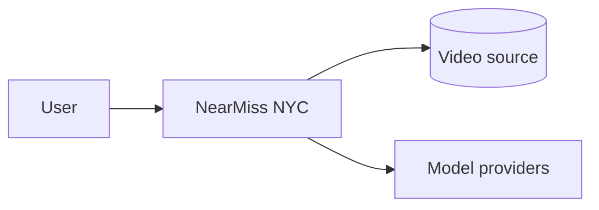

# System Context

The system as a black box: who and what it talks to.

> [!todo] Not filled in yet
> Replace the placeholder diagram with the real actors.

## External dependencies

| Dependency | Purpose | Failure mode | Fallback |
|---|---|---|---|
| {{DEPENDENCY}} | | | |

## Trust boundaries

There is no authentication — see [[ADR-005-No-Authentication]]. That makes the
deployment boundary the only real control; note the implication in
[[08-Deployment]].

---
Related: [[02-High-Level-Design]] · [[08-Deployment]] · [[ADR-005-No-Authentication]] · [[01-Project-Overview]]
