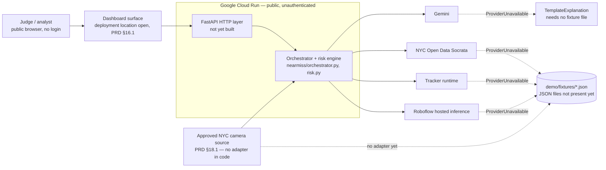

# System Context

The system as a black box: who and what it talks to.

Inside the box, `app/backend/nearmiss/` is 1,039 lines of real code —
`orchestrator.py`, `risk.py`, `models.py`, `config.py`, and six provider
modules. What is missing is not implementation but reach: nothing serves any of
it over HTTP, and the fixture files the fallback path reads do not exist, so the
box cannot currently complete a run. Everything drawn outside it is a dependency
the box either calls or declines to call. The internal pipeline is
[[02-High-Level-Design]]; the adapter shapes are [[07-Provider-Adapters]].

> [!important] Every runtime provider currently declines
> `nearmiss/providers/` holds a runtime class and a fixture class per boundary,
> and every runtime class raises `ProviderUnavailable` at P0 — `RoboflowVision`,
> `ByteTrackTracker`, `NycOpenDataContext`, and `GeminiExplanation` all do.
> `nearmiss/orchestrator.py` catches that exception at each rung and appends a
> user-facing notice. The fixture rung underneath cannot serve anything yet:
> `demo/fixtures/` contains a README and no JSON, so `load_fixture` in
> `providers/base.py` raises `FileNotFoundError`. That is loud on the detection
> and tracking rungs, where nothing catches it and the run aborts. It is not
> loud on the context rung — `orchestrator._context` catches
> `FileNotFoundError` there and degrades once more, to no context at all.

## External dependencies

FR-015 requires a fallback for every external dependency and names the intended
pairings; read that list in [[00-Source-of-Truth-PRD|PRD]] rather than here.
What this table adds is the state of each fallback in `app/backend/nearmiss/`,
plus the dependencies FR-015 does not cover at all.

| Dependency | Purpose | Failure mode | Fallback |
|---|---|---|---|
| Google Cloud Run | Hosts the public agent; PRD §2.2 makes deployment there the eligibility gate | Not deployed, not public, or `GET /health` not answering 200 → the submission is not hackathon-complete | None. FR-015 has no row for the host, and a local run does not satisfy §2.2. Not yet built: there is no HTTP layer in `app/backend/`, only `fastapi`/`uvicorn` declared in `pyproject.toml` |
| Approved NYC camera source (PRD §18.1) | Real-source retrieval for the live path | Source down, throttled, or serving a repeated still frame — which §18.4 forbids treating as new temporal evidence | Not yet built: `nearmiss/providers/` has no source adapter, no provenance record, and no content hash, so there is nothing to fall back from or to |
| Roboflow hosted inference | Detection; the preferred perception provider per PRD §2.4 | `providers/vision.py` `RoboflowVision.detect` raises `ProviderUnavailable` when `ROBOFLOW_API_KEY` or `ROBOFLOW_MODEL_ID` is unset, and raises unconditionally after that | `FixtureVision.detect` reads `detections.json` from the fixture dir and validates each entry through `Detection`. Implemented, but the file does not exist, so the call raises `FileNotFoundError` |
| Tracker runtime (ByteTrack or Roboflow `trackers`) | Multi-frame association | `providers/tracking.py` `ByteTrackTracker.track` always raises `ProviderUnavailable` | `FixtureTracker.track` reads `tracks.json` and ignores the detections handed to it. Implemented, but the file does not exist |
| NYC Open Data Socrata | Historical collision context near the event (PRD §18.2) | `providers/context.py` `NycOpenDataContext.lookup` raises when the event has no coordinates, and raises again as unimplemented. Which fields are stable is still a §30 open question ("Which NYC Open Data fields are stable?") | `CachedContext.lookup` reads `context.json`, whose `source` field is expected to mark the data as cached. Implemented, but the file does not exist — and `orchestrator._context` catches that `FileNotFoundError` and degrades once more, to no context at all |
| Gemini | Structured explanation; P1 only, per PRD §29 | `providers/explanation.py` `GeminiExplanation.explain` raises when `GEMINI_API_KEY` is unset and raises as unimplemented otherwise | `TemplateExplanation` is the only fallback on this list that needs no fixture file, which makes it the only rung that can run today. It restates supplied evidence, always emits the two baseline limitations, and recommends human review for high severity |
| `demo/fixtures/*.json` | The floor every rung above falls to | Missing file → `providers/base.py` `load_fixture` raises `FileNotFoundError`. A malformed file is not handled at all: `load_fixture` calls `json.load` unguarded, so bad JSON surfaces as `json.JSONDecodeError` and a shape mismatch as a pydantic `ValidationError` in the calling provider | None by design. Currently unbuilt: the directory holds only `README.md`, so the fixture floor does not yet exist |
| `vision-conflict-analytics` (pinned release) | PRD §29 locks pairwise conflict analysis to this public package, consumed as a pinned dependency | Package unavailable or version drift | Not yet built: `pyproject.toml` declares no such dependency and `nearmiss/risk.py` implements the pairwise engine in-repo. See [[11-Vision-Conflict-Analytics-Package]] |
| Primary dashboard | The judge-facing surface | Dashboard fails to load or render during the demo | Not yet built on either side: `app/frontend/` holds only `README.md`, and no backup recording or screenshots are committed |
| Veris AI | Evaluation-plane scenario testing against the deployed agent | Requirements unconfirmed at kickoff | PRD §2.4 makes this conditional, not a runtime dependency: skip it, and its absence must not endanger eligibility or either demo path |
| Roboflow MCP server | Development-plane tooling that configures perception assets | Unavailable while building | PRD §29 keeps it off the runtime path, so a failure has no runtime consequence |

Two mismatches between the requirement and the code are worth naming rather
than smoothing over. FR-016 requires exactly one of five named processing
modes; `nearmiss/models.py` defines three (`live_feed`, `runtime_analysis`,
`demonstration_replay`) and `orchestrator.py` only ever emits the latter two.
And `orchestrator.py` reads its provider credentials directly from
`os.getenv`, while `config.py` `Settings` uses the `NEARMISS_` env prefix for
everything else — two conventions for one process.

## Trust boundaries

There is no authentication — see [[00-Source-of-Truth-PRD|PRD]] §29. That is
not a gap left open for time reasons. NFR-002 requires the service to be public
through `--allow-unauthenticated` or `--no-invoker-iam-check`, and §2.2 requires
it to be reachable without judge authentication, so anonymous access is a
condition of passing the eligibility gate. Adding auth would fail the gate.

That makes the deployment boundary the only real control; note the implication
in [[08-Deployment]]. NFR-010 puts the rest of the burden inside that boundary:
credentials stay server-side, no `.env` is committed, uploaded files are
constrained by type and size, temporary files are deleted after processing where
practical, and source URLs carrying API keys are not returned to clients. The
separate ceiling on request payload size belongs to NFR-004, which caps them
below the Cloud Run HTTP/1 body limit. What is verified in code today is
narrow — `orchestrator.py` keeps keys in provider instances rather than in any
response, and `providers/base.py` documents
`ProviderUnavailable` as carrying a user-readable reason with no stack trace or
secret, which the raised reasons honour. The upload constraints, temporary-file
handling, and URL scrubbing NFR-010 also requires have no code yet, because
there is no request-handling layer to put them in.

One boundary is closed by construction: §29 forbids identity recognition, and
no adapter in `nearmiss/providers/` talks to any recognition service.

---
Related: [[02-High-Level-Design]] · [[08-Deployment]] · [[00-Source-of-Truth-PRD|PRD]] §29 · [[01-Project-Overview]]
