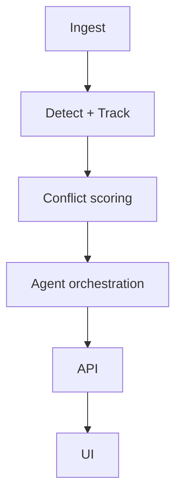

# High Level Design

> [!todo] Not filled in yet
> Replace with the real component graph once [[04-Component-Design]] settles.

## Shape

One orchestrated pipeline rather than independent services — rationale in
[[ADR-004-Single-Orchestrated-Pipeline]].

## Components

| Component | Responsibility | Detail |
|---|---|---|
| {{COMPONENT}} | | [[04-Component-Design]] |

## Key constraints

- Must run end-to-end on fixtures ([[ADR-001-Deterministic-Demo-First]])
- Model/vendor choices isolated behind adapters ([[ADR-003-Provider-Adapter-Architecture]])

---
Related: [[01-System-Context]] · [[03-Data-Flow]] · [[04-Component-Design]] · [[ADR-004-Single-Orchestrated-Pipeline]]
