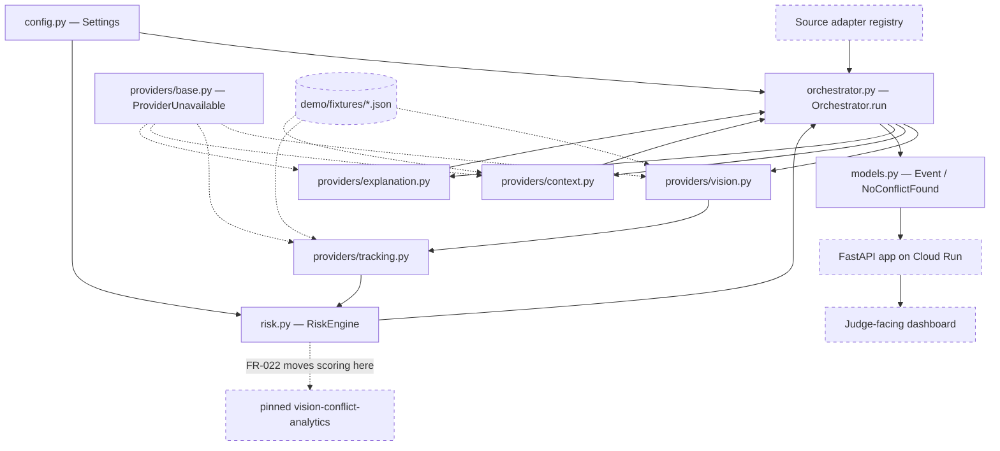

# High Level Design



> [!note] Solid boxes exist in `app/backend/nearmiss/`; dashed boxes do not
> Roughly 1,000 lines of the pipeline core are written. Everything that faces
> outward — the FastAPI app, the source adapter registry, the fixture JSON, the
> pinned analytics package, the dashboard — is specified in
> [[00-Source-of-Truth-PRD|PRD]] §16.1 and not yet built. Per-component
> interfaces belong in [[04-Component-Design]], which already carries them —
> one section per module plus a section per unbuilt piece.

## Shape

One orchestrated pipeline rather than independent services — [[00-Source-of-Truth-PRD|PRD]]
§29, "One orchestrated pipeline, not a multi-agent council." §16.2 states the
runtime request flow as a single linear sequence from source validation to
rendered report.

`nearmiss/orchestrator.py` implements that shape literally: `Orchestrator.run()`
is one method that calls detect → track → score → threshold → context → explain
and returns a `PipelineResult` holding either an `Event` or a `NoConflictFound`,
plus a list of degradation notices. There is no queue, scheduler, or
inter-component messaging in the source tree.

## Components

The rows below follow §16.1's mandatory agent service list, then the modules
that exist in code without a §16.1 entry of their own.

| Component | Responsibility | Detail |
|---|---|---|
| FastAPI service — **not built** | §16.1 requires FastAPI as the mandatory agent service. `app/backend/pyproject.toml` declares `fastapi>=0.115` and `uvicorn[standard]>=0.32`, but no application module exists anywhere under `app/backend/`. | [[05-API-Contracts]] |
| Cloud Run public endpoint — **not built** | §16.1 requires a public endpoint; §29 makes the public Cloud Run agent mandatory. Nothing in the backend source addresses deployment. | [[08-Deployment]] |
| Source adapters — **not built** | FR-001 requires a server-side registry of approved sources and FR-003 requires a provenance/freshness record per frame. `nearmiss/providers/` contains no source module, and `nearmiss/models.py` has no provenance model. | [[07-Provider-Adapters]] |
| Perception adapter — **partly built** | `nearmiss/providers/vision.py` has both halves of the boundary: the runtime provider declines cleanly rather than guessing a model, and the fixture provider is implemented but reads a `detections.json` that does not exist. | [[07-Provider-Adapters]] |
| Tracking adapter — **partly built** | `nearmiss/providers/tracking.py`, same shape: runtime declines, fixture path implemented against an absent `tracks.json`. §16.1 does not list tracking separately; the §16 diagram does, as "Tracker for Multi-frame Input". | [[07-Provider-Adapters]] |
| Pinned `vision-conflict-analytics` — **not built** | FR-022 and §29 require pairwise track-interaction scoring to live in the standalone public package and be consumed as a pinned release. Scoring currently lives in `nearmiss/risk.py`, and `pyproject.toml` declares no such dependency. | [[11-Vision-Conflict-Analytics-Package]] |
| Context adapter — **partly built** | `nearmiss/providers/context.py`: runtime lookup declines, cached path implemented against an absent `context.json`. This is the one fixture-backed rung the orchestrator survives without its file: it catches the resulting `FileNotFoundError` and emits the event with no historical context at all. | [[07-Provider-Adapters]] |
| Explanation adapter — **partly built** | `nearmiss/providers/explanation.py` is the only adapter whose fallback runs today: the deterministic template needs no file. It drifts from §23.10 — it appends the historical-context sentence into the observations list, which §23.10 requires to stay separate from evidence observed in the clip. | [[07-Provider-Adapters]] |
| Fixture / captured-replay assets — **built, synthetic** | §16.1 lists them as mandatory. `demo/fixtures/` holds `detections.json`, `tracks.json`, and `context.json`; the pipeline completes end-to-end at 84.3 / `high` / `demonstration_replay`, 120 detections across 2 tracks. The sequence is **generated, not a source-attributed NYC capture**, and `context.json` reads `source: synthetic_placeholder`, so §11.1's captured-evidence baseline is runnable but not satisfied. | [[00-Source-of-Truth-PRD\|PRD]] §11.1 |
| Orchestrator — **built** | `nearmiss/orchestrator.py`. Owns the fallback ladder: each rung catches `ProviderUnavailable`, appends a human-readable notice, and calls the fixture implementation (FR-015). Sets processing mode to `runtime_analysis` only when both the vision and tracker runtime providers actually served, otherwise `demonstration_replay` (FR-016). Emits `NoConflictFound` rather than manufacturing an event when nothing clears the threshold (FR-017), though the message wording differs from FR-017's mandated sentence — the code says "in this clip", FR-017 says "in the available evidence" — and no §13 `no_candidate_conflict` outcome state is carried. | [[04-Component-Design]] |
| Risk engine — **built** | `nearmiss/risk.py`. `RiskEngine.evaluate()` scores every supported pair and returns them sorted highest first, leaving threshold filtering to the caller. Pairs are restricted to vehicle-to-vulnerable-road-user (FR-009) and gated on track length and temporal overlap before scoring. Distances are normalized against the frame diagonal — image space only (FR-007, FR-010). | [[04-Component-Design]] |
| Shape contract — **built** | `nearmiss/models.py`. Pydantic v2 models with `extra="forbid"`, covering `Detection`, `Track`, `RiskFactors`, `Event`, `NoConflictFound`, and `Health`. This is the note-side contract in [[06-Data-Model]]. | [[06-Data-Model]] |
| Settings — **built** | `nearmiss/config.py`. `Settings` reads `NEARMISS_`-prefixed environment variables and carries the threshold, severity cut, factor weights, normalization scales, evidence guards, and the vulnerable/vehicle class sets. | [[04-Component-Design]] |
| Judge-facing dashboard — **not built** | §16.1 allows either a separately deployed Next.js app or a frontend served by the Cloud Run service, and states the dashboard's location is not the eligibility gate. `app/frontend/` holds only `README.md`. | [[00-Source-of-Truth-PRD\|PRD]] §11.3 |

## Key constraints

- **One orchestrated pipeline, not a multi-agent council** ([[00-Source-of-Truth-PRD|PRD]] §29). Satisfied: `nearmiss/orchestrator.py` is a single `Orchestrator.run()` call chain.
- **Provider-adapter architecture** ([[00-Source-of-Truth-PRD|PRD]] §29), with a fallback for every external dependency (FR-015). Wired for four of the six FR-015 pairs: `nearmiss/providers/base.py` defines the `VisionProvider`, `TrackerProvider`, and `ContextProvider` protocols plus `ProviderUnavailable`, and no vendor SDK is imported anywhere in the package — though that boundary is untested, since every runtime adapter declines before it would need a client. Wired is not the same as executable: only the Gemini→template rung degrades to a working substitute today. The vision and tracker rungs fall back into `demo/fixtures/` files that do not exist, so `load_fixture()` raises `FileNotFoundError` and no run completes; the context rung survives its missing fixture only because the orchestrator catches that error and drops historical context entirely. The live-source and dashboard fallbacks have no code yet.
- **Pairwise conflict analysis is owned by the pinned `vision-conflict-analytics` package** ([[00-Source-of-Truth-PRD|PRD]] §29; FR-022). Not satisfied — the scoring lives in `nearmiss/risk.py`. Closing this is the largest structural change still outstanding; see [[11-Vision-Conflict-Analytics-Package]].
- **Visual conflict-risk proxy, not true collision probability** ([[00-Source-of-Truth-PRD|PRD]] §29; FR-010). Enforced in code: `nearmiss/risk.py` works only in pixels against the frame diagonal, and `providers/explanation.py` attaches an unconditional limitation saying the score is a proxy and the camera is uncalibrated.
- **Threshold is 70/100 and server-side configurable** (FR-011). Satisfied: `Settings.alert_threshold` defaults to `70.0` and is bounded 0–100.
- **The temporal-evidence gate must produce `insufficient_temporal_evidence`** (FR-008). Partly satisfied: `RiskEngine._has_enough_evidence()` gates on minimum track points and minimum temporal overlap, but a failed gate silently drops the pair — no `insufficient_temporal_evidence` outcome state exists in `nearmiss/models.py`. The gate is also stricter and narrower than FR-008 asks: `Settings.min_track_points` defaults to 8 where FR-008 requires at least three usable observations per track, and the required track-continuity check is not computed at all.
- **FR-010's evidence-quality multiplier is missing.** The FR-010 formula is `base_risk × evidence_quality`; `nearmiss/risk.py` implements the weighted sum of the four base factors and stops there, treating evidence quality as a hard pre-filter instead. `RiskFactors` in `nearmiss/models.py` has no `evidence_quality` field, so the multiplier is not merely unapplied — there is nowhere to carry it.
- **Exactly one processing mode is disclosed and fallback is never shown as live** (FR-016). Partly satisfied: `models.py` defines three literals — `live_feed`, `runtime_analysis`, `demonstration_replay` — and none of the three matches any of the five labels FR-016 names, so the whole vocabulary needs reconciling.
- **Evidence package completeness** (FR-012). Partly satisfied: `Event` carries event id, type, severity, score, factors, participants, time window, representative frame, overlay, provider metadata, and limitations, but no §13 outcome state, no analysis identifier, no source provenance, and no temporal-evidence status. The full §20 field list those four are missing from is in [[06-Data-Model]].
- **No authentication** ([[00-Source-of-Truth-PRD|PRD]] §29), which makes the deployment boundary the only control — see [[01-System-Context]] and [[08-Deployment]].

## Plan — Thursday 6 August, 12:50 PM

Produced by [[03-Plan-Prompt]]. Governing constraint: §11.1's readiness rule
fires **tonight at 8:00 PM**, ~7 hours out. Constitution principle 1 puts the
eligibility path ahead of everything else.

### What tonight is, precisely

§2.2 lists **five** conditions and is a **Friday 8:30 PM** gate. §11.1's
*deployment baseline* is tonight's gate and is narrower — public service,
`GET /health` → 200, `0.0.0.0:$PORT`, known-good revision and rollback command
recorded. Do not conflate them: tonight's target is the baseline; §2.2's
"working real-source analysis endpoint" and "identify the deployed revision and
active processing mode" are Friday's.

But §11.2 permits only *configuration* on event day, not construction. So the
real-source endpoint must **exist** tonight even though it will degrade to the
fixture rung until a source is configured.

### 1. Components to build — only what does not exist

| # | Component | Requirement | Why in this position |
|---|---|---|---|
| 1 | `nearmiss/main.py` — FastAPI app, `/health` only | FR-019, NFR-001 | Smallest artifact that can be deployed |
| 2 | `app/backend/Dockerfile` | NFR-001 | Must copy `demo/fixtures/` — ADR-010 makes them runtime data, not test data |
| 3 | Cloud Run deploy + logged-out verification | §2.2, §11.1 | The gate |
| 4 | Remaining endpoints — `/api/v1/sources`, `/api/v1/demo`, `POST /api/v1/live/{source_id}/analyze` | [[05-API-Contracts]], FR-001, FR-018 | Must exist tonight so Friday is configuration |
| 5 | `SourceProvider` adapter + `SourceFrame` provenance model | FR-002, FR-003 | The §11.2 event-day swap point |
| 6 | Six judge-facing surfaces | §11.3 | §29 prefers Next.js **but forbids it endangering the agent** — so it follows the deploy, never precedes it |
| 7 | `tests/` — fixture parity, risk engine, fallback ladder, `/health` | §11.1 | Makes any later "tests pass" claim meaningful |

### 2. Interfaces — including the signature change

**`VisionProvider.detect()` takes no arguments** (`providers/base.py:31`), so a
fetched frame has nowhere to go. [[03-Plan-Prompt]] correctly calls this a
blast-radius change. It does not have to be:

```python
def detect(self, frame: SourceFrame | None = None) -> list[Detection]: ...
```

An **optional parameter defaulting to `None`** makes it additive. `FixtureVision`
ignores it and keeps working; `RoboflowVision` uses it when present; the
`orchestrator._detect` call site is unchanged until it has a frame to pass. The
Protocol, both implementations, and the call site still move together — but they
move without a breaking window, which is what makes it doable tonight.

**New — `SourceProvider`**, the FR-002 boundary that does not exist:
`fetch(source_id) -> SourceFrame`, where `SourceFrame` carries FR-003's
provenance fields: `source_id`, `retrieved_at`, `content_hash`,
`freshness_seconds`, `cache_status`. The content hash is also §18.4's
duplicate-frame guard, so it lands with this model or not at all.

**Not moving tonight:** `base.py` still declares no `ExplanationProvider`, so
the fourth family stays duck-typed while the other three are checkable.

### 3. Riskiest assumption, and the first thing to test

**That `gcloud run deploy` succeeds on this machine against a personal-Gmail
project with billing enabled.** Every other task is downstream of it, and the
failure modes — unauthenticated CLI, billing not enabled, APIs not enabled,
org-policy blocking `--allow-unauthenticated`, Artifact Registry region — are
all *external* and none are fixable by writing better Python.

**Test it first, before writing the real application.** Deploy a ten-line
FastAPI returning `{"status":"ok"}`. If it fails, that is discovered at 1:00 PM
with seven hours of runway, not at 7:00 PM with one. This inverts the obvious
order — fixtures and API first, deploy last — and the inversion is the point.

{{GCP_PROJECT_ID}} and {{GCP_BILLING_STATE}} are unknown; both are open
questions until the first deploy answers them.

### 4. §29 locked decisions touched

**None require §31.** Checked individually:

- *"Next.js dashboard is preferred but not allowed to endanger the Cloud Run
  agent"* — deploying the backend alone first, then the dashboard, is what this
  decision **instructs**. [[08-Deployment]] independently says deploy the health
  skeleton before choosing a topology. Compliant, no action.
- *"Pairwise analysis owned by the pinned `vision-conflict-analytics` package"* —
  not met tonight. That is a **failure to meet** a locked decision, not a change
  to one, so it is a deviation for [[05-Decision-Log]], not a §31 amendment.
- *"Real NYC source analysis is part of P0"* — unchanged and still P0; the
  endpoint is built tonight, the source configured Friday.

§31 is for *changing* a locked decision. Nothing here changes one.

### 5. Deliberately not building before Friday

- `vision-conflict-analytics` extraction (FR-022) — deviation, logged
- The §20 contract refactor — deferred until after the gate is green
- Runtime Roboflow inference — the API key is **two days overdue** (§27.1 item 8)
- Gemini explanation, runtime NYC Open Data lookup — both P1 (§11.4)
- Veris — conditional, and §2.4 forbids claiming credit without confirmation
- `ExplanationProvider` protocol, docstring renumbering — cosmetic

### The eight contradictions — fix or deviation

[[03-Plan-Prompt]] requires a disposition for each. Three are cheap and two of
those are honesty obligations, so they are fixed; five are deferred.

| # | Contradiction | Disposition |
|---|---|---|
| 2 | `ProcessingMode` has 3 values, FR-016 names 5, none match | **Fix** — a literal rename plus the `orchestrator._severity`-adjacent mapping. §2.2 requires the deployed service to identify its active mode, so this sits on the gate. |
| 4 | `explanation.py` appends historical context into `observations`; §23.10 requires separation | **Fix** — Constitution principle 5. Verified live: the collision sentence appears inside `observations` today. |
| 7 | FR-017 mandates "in the available evidence"; code says "in this clip" | **Fix** — one string. |
| 1 | FR-010's `evidence_quality` multiplier never applied, no field to carry it | **Deviation** — needs `RiskFactors` + `risk.py`; part of the §20 refactor. |
| 3 | `event_id` not `analysis_id`; no `outcome`, `source`, `temporal_evidence`, `model` | **Deviation** — the §20 refactor itself. |
| 5 | `min_track_points = 8` vs FR-008's three; track continuity never computed | **Deviation** — changing the gate now moves the demo score. |
| 6 | Severity `low` unreachable | **Deviation** — no P0 impact; sub-threshold pairs emit no event. |
| 8 | Docstrings cite v1 FR numbers and retired ADR-010 | **Deviation** — cosmetic, zero behavioural effect. |

All five deviations go to [[05-Decision-Log]] in one entry, per
[[02-Workflow]]'s rule that silently leaving a contradiction is a principle 7
violation.

---
Related: [[01-System-Context]] · [[03-Data-Flow]] · [[04-Component-Design]] · [[07-Provider-Adapters]] · [[11-Vision-Conflict-Analytics-Package]] · [[00-Source-of-Truth-PRD|PRD]] §16, §29
