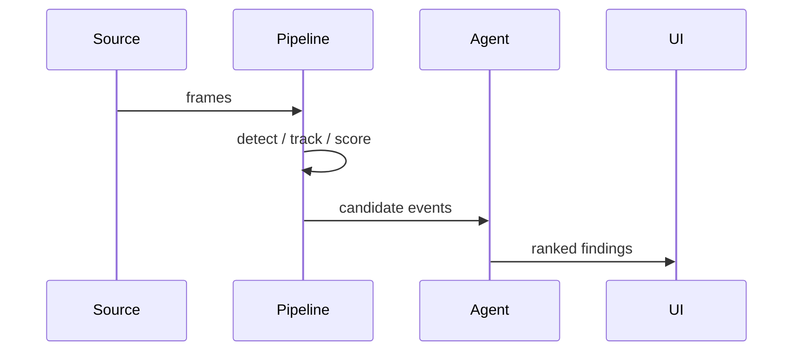

# Data Flow

> [!todo] Not filled in yet
> Confirm against the real implementation; diagrams drift fastest.

## Stages

| Stage | Input | Output | Where it runs | Latency budget |
|---|---|---|---|---|
| {{STAGE}} | | | | {{MS}} |

## Data at rest

Shapes are defined in [[06-Data-Model]]. Retention and PII posture in
[[10-Responsible-AI]].

## Backpressure and failure

- [ ] What happens when a stage is slower than its input?
- [ ] What happens when a provider call fails? → [[07-Provider-Adapters]]

---
Related: [[02-High-Level-Design]] · [[06-Data-Model]] · [[07-Provider-Adapters]] · [[09-Observability]]
