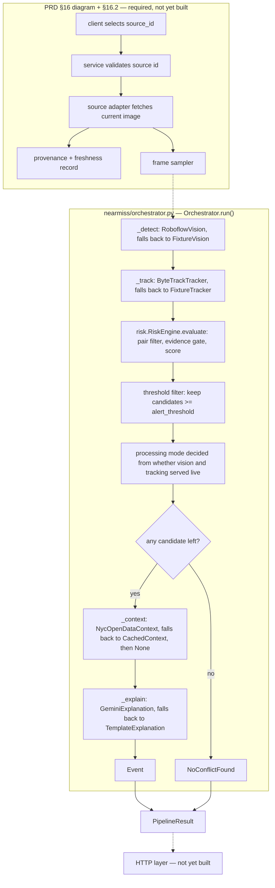

# Data Flow

The flow below is traced from `app/backend/nearmiss/orchestrator.py`. The solid
path is code that exists; the dashed prefix is what
[[00-Source-of-Truth-PRD|PRD]] §16 requires ahead of it and is not yet built.
The select → validate → fetch → provenance sequence is §16.2's linear flow; the
fan-out to a frame sampler is from the §16 architecture diagram, which §16.2
does not restate.

> [!warning] The pipeline has no ends yet
> `Orchestrator.run()` takes an `event_id` string and nothing else. There is no
> source adapter, no frame sampler, no provenance record, and no HTTP layer
> under `app/backend/` — the whole flow starts at detection and ends at an
> in-process `PipelineResult`. `demo/fixtures/` currently holds only a
> `README.md`, so even the fixture path raises `FileNotFoundError` from
> `nearmiss/providers/base.py`. Contracts for the missing ends are in
> [[05-API-Contracts]].

## Stages

| Stage | Input | Output | Where it runs | Latency budget |
|---|---|---|---|---|
| Source validation and fetch | `source_id` | current image | not yet built — PRD §16.2, FR-002 | shares the under-20 s live fetch-plus-perception target (NFR-006) |
| Provenance record | fetched image | the FR-003 provenance fields — enumerated in [[06-Data-Model]] | not yet built — PRD FR-003 | {{MS}} — NFR-006 gives no per-stage split |
| Frame sampling | one of FR-004's accepted inputs | frames | not yet built — PRD §16 diagram (`Frame Sampler`); §16.2 does not name this stage | {{MS}} — NFR-006 gives no per-stage split |
| Detection | none in code; `detect()` takes no arguments | `list[Detection]` | `nearmiss/orchestrator.py` `_detect` → `nearmiss/providers/vision.py` | shares the under-20 s live fetch-plus-perception target (NFR-006) |
| Tracking | `list[Detection]` | `list[Track]` | `nearmiss/orchestrator.py` `_track` → `nearmiss/providers/tracking.py` | {{MS}} — NFR-006 gives no per-stage split |
| Pair filter and evidence gate | `list[Track]` | supported pairs that clear `min_track_points` and `min_overlap_seconds` | `nearmiss/risk.py` `_is_supported_pair`, `_has_enough_evidence` | {{MS}} — NFR-006 gives no per-stage split |
| Risk scoring | supported pairs | `Candidate` list, highest score first | `nearmiss/risk.py` `RiskEngine.evaluate` | {{MS}} — NFR-006 gives no per-stage split |
| Threshold and mode decision | `Candidate` list | over-threshold list, one `ProcessingMode` | `nearmiss/orchestrator.py` `run` | {{MS}} — NFR-006 gives no per-stage split |
| Context enrichment | `Location` | `HistoricalContext` or `None` | `nearmiss/orchestrator.py` `_context` → `nearmiss/providers/context.py` | {{MS}} — NFR-006 gives no per-stage split |
| Explanation | candidate, context, severity | observations, limitations, recommended action, confidence | `nearmiss/orchestrator.py` `_explain` → `nearmiss/providers/explanation.py` | {{MS}} — NFR-006 gives no per-stage split |
| Assembly | all of the above | `Event` or `NoConflictFound`, plus fallback notices | `nearmiss/orchestrator.py` `run` | {{MS}} — NFR-006 gives no per-stage split |

NFR-006's remaining targets are stated for a whole request, not for any single
stage above: captured replay begins within 2 s, P1 short-sequence analysis
lands under 60 s, a health response comes back under 500 ms, and any operation
over 2 s shows progress. The last two have no code to attach to — there is no
`/health` handler and no progress channel; `nearmiss/models.py` defines a
`Health` model but nothing serves it.

Three divergences between the table and the PRD, all checked in code:

- FR-022 requires the pairwise engine to live in the standalone
  `vision-conflict-analytics` package and be consumed as a pinned release.
  `nearmiss/risk.py` implements it as backend-local application logic. See
  [[11-Vision-Conflict-Analytics-Package]].
- FR-010's formula multiplies the weighted base risk by an evidence-quality
  factor. `nearmiss/risk.py` computes only the weighted sum; evidence quality
  is a pass/fail gate in `_has_enough_evidence`, not a multiplier.
- FR-008 requires a failed temporal gate to produce an
  `insufficient_temporal_evidence` outcome. In `nearmiss/risk.py` a pair that
  fails the gate is silently dropped by `score_pair`, and `nearmiss/models.py`
  has no such outcome state. Likewise FR-016 requires exactly one of five named
  processing modes to be active; `ProcessingMode` in `nearmiss/models.py` is a
  three-value literal — `live_feed`, `runtime_analysis`, `demonstration_replay`
  — and none of the three is one of FR-016's five names.

## Data at rest

Shapes are defined in [[06-Data-Model]]. Retention and PII posture in
[[10-Responsible-AI]]; the binding statement is PRD NFR-011, which bars
re-identification and unnecessary long-term raw-video retention.

Nothing is persisted today. `Orchestrator.run()` builds the result in memory
and returns it; no database, cache, or write path exists in
`app/backend/nearmiss/`. The only reads from disk are the fixture files
`detections.json`, `tracks.json`, and `context.json` under `demo/fixtures/`,
loaded by `load_fixture` in `nearmiss/providers/base.py`. The content hashing
and duplicate-frame suppression PRD §18.4 asks for is not yet built.

## Backpressure and failure

- **What happens when a stage is slower than its input?** No queue at P0. PRD
  NFR-004 governs concurrency and request behavior; the operative line here is
  a default model-processing concurrency of 1. One request is processed at a
  time, so there is no input to fall behind. The code matches by construction rather
  than by design: `nearmiss/` contains no `async def`, no lock, and no
  semaphore — the pipeline is a straight blocking call. Enforcing concurrency 1
  is a deployment setting, not application code.
- **What happens when a provider call fails?** → [[07-Provider-Adapters]]. PRD
  FR-015 requires a fallback for every external dependency.
  `nearmiss/providers/base.py` defines `ProviderUnavailable`, and each of the
  four ladder rungs in `nearmiss/orchestrator.py` catches it and substitutes
  the fixture implementation. Context is the one rung that can degrade twice:
  runtime → cached → `None`, because an event stays valid without it. Every
  step-down appends a user-readable line to `PipelineResult.notices`. All four
  runtime providers currently raise `ProviderUnavailable` unconditionally, so
  the fallback path is the only path that runs. NFR-008 also requires
  structured logs; `nearmiss/` imports no logging at all, so that half is not
  yet built → [[09-Observability]].

> [!note] Code comments cite a superseded PRD
> Docstrings across `nearmiss/` cite FR numbers and ADRs from the pre-2.0 PRD —
> `providers/vision.py` calls provider fallbacks FR-011, which is now the
> candidate threshold, and several files cite ADRs that were revoked when
> v2.0.0 landed. Trust the identifiers in this note, not the ones in the source
> comments.

---
Related: [[02-High-Level-Design]] · [[06-Data-Model]] · [[07-Provider-Adapters]] · [[09-Observability]]
