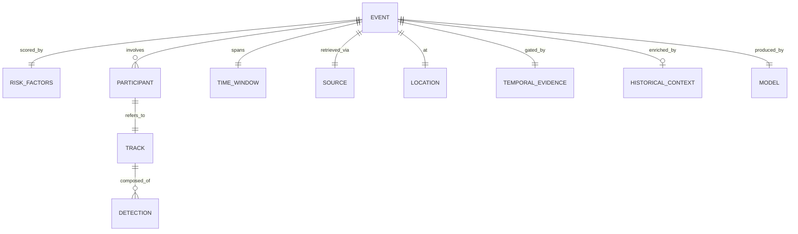

# Data Model

> [!info] Source
> [[PRD]] §20 (core data contract), plus FR-003 (provenance and freshness),
> FR-005 (detection), FR-006 (tracking), FR-008 (temporal-evidence gate),
> FR-010 (risk proxy), and FR-012 (evidence package). PRD v1's FR-002/003/006/008
> citations pointed at different content under v2's renumbering — remapped here
> by topic, not by number.
> Field names below are taken from the §20 JSON exactly — keep them identical to
> the payloads in [[05-API-Contracts]].

## Entities

### Event

| Field | Type | Required | Notes |
|---|---|---|---|
| `analysis_id` | string | yes | e.g. `nmyc_live_20260807_001`. Renamed from `event_id` in PRD v2.0 (§20) |
| `outcome` | enum | yes | `no_candidate_conflict` \| `insufficient_temporal_evidence` \| `candidate_conflict_detected` \| `analysis_failed_with_fallback` (§13). All four are valid, locked results — a live no-conflict or insufficient-evidence result is never converted into a fabricated `candidate_conflict_detected` (§23 item 15, §29) |
| `event_type` | enum | when applicable | `vehicle_pedestrian_conflict` \| `vehicle_cyclist_conflict` \| `turning_vehicle_vulnerable_user_conflict` — present only when `outcome` is `candidate_conflict_detected` (§13, FR-012) |
| `severity` | enum | when applicable | `low` \| `medium` \| `high` — derived from the risk proxy and evidence quality, **not** a crash probability (§13, FR-012) |
| `risk_score` | float | when applicable | 0–100. Candidate-event threshold is 70 and configurable (FR-011) |
| `risk_factors` | RiskFactors | when applicable | (FR-012) |
| `participants` | Participant[] | yes | |
| `time_window` | TimeWindow | yes | |
| `source` | Source | yes | Provenance and freshness (FR-003) |
| `location` | Location | yes | |
| `processing_mode` | enum | yes | see below (FR-016) |
| `temporal_evidence` | TemporalEvidence | yes | Result of the FR-008 gate |
| `observations` | string[] | yes | Grounded in the evidence package only (FR-014) |
| `historical_context` | HistoricalContext | no | Absent when no location is known |
| `model` | Model | yes | Provider/workflow metadata (FR-012) |
| `limitations` | string[] | yes | At least one, always (§23 item 7) |
| `recommended_action` | string | yes | High severity must recommend human review (§23 item 8) |

> [!warning] Wire value vs UI label
> `processing_mode` is snake_case on the wire and title-case in the UI badge.
> PRD v2.0 FR-016 expanded the mode set to five: `Live NYC snapshot`,
> `Live sampled sequence`, `Runtime sequence analysis`, `Captured feed replay`,
> `Demonstration fixture` — replacing v1's three-mode `Live feed` /
> `Runtime analysis` / `Demonstration replay`. Wire values:
> `live_nyc_snapshot` \| `live_sampled_sequence` \| `runtime_sequence_analysis` \|
> `captured_feed_replay` \| `demonstration_fixture`. Only `captured_feed_replay`
> is confirmed verbatim by the §20 JSON example — the other four follow the same
> snake_case convention but should be confirmed against [[05-API-Contracts]]
> when it defines them; do not treat them as final until then. Exactly one mode
> is active at a time and it must always be visible, and fallback operation
> shall never be represented as live inference (FR-016).

### RiskFactors

| Field | Type | Required | Notes |
|---|---|---|---|
| `proximity` | float | yes | 0–1, weight 0.35 |
| `path_overlap` | float | yes | 0–1, weight 0.35 |
| `closing_motion` | float | yes | 0–1, weight 0.20 |
| `vulnerable_user` | float | yes | 0–1, weight 0.10 |
| `evidence_quality` | float | yes | 0–1, multiplicative adjustment: `risk = base_risk × evidence_quality`. Low evidence quality reduces the score or prevents scoring entirely (§19.2) |

Reference weighting and formula (FR-010): `base_risk = 0.35×proximity +
0.35×path_overlap + 0.20×closing_motion + 0.10×vulnerable_user`, then
`risk = base_risk × evidence_quality`. Weights may be tuned against the
selected demo clip, but **every change is recorded in [[05-Decision-Log]]**.
`evidence_quality` is no longer optional in PRD v2.0 — it is a required field
in the §20 contract.

### Participant

| Field | Type | Required | Notes |
|---|---|---|---|
| `track_id` | int | yes | References a Track |
| `class_name` | string | yes | One of the FR-005 classes |

### TimeWindow

| Field | Type | Required | Notes |
|---|---|---|---|
| `start_seconds` | float | yes | |
| `end_seconds` | float | yes | |

### Location

| Field | Type | Required | Notes |
|---|---|---|---|
| `label` | string | yes | e.g. `Demo intersection` |
| `latitude` | float \| null | yes | Null when unknown — nullable, not omitted |
| `longitude` | float \| null | yes | Null when unknown |

### Source

New in PRD v2.0 (§20) — provenance and freshness metadata, required on every
result regardless of outcome.

| Field | Type | Required | Notes |
|---|---|---|---|
| `source_id` | string | yes | References the FR-001 source registry entry |
| `display_name` | string | yes | |
| `provider` | string | yes | |
| `jurisdiction` | string | yes | |
| `retrieved_at` | ISO-8601 string | yes | |
| `source_timestamp` | ISO-8601 string \| null | yes | Null when the source does not expose one — nullable, not omitted |
| `freshness_seconds` | int | yes | |
| `cache_status` | string | yes | e.g. `miss`, `hit` |
| `content_hash` | string | yes | |

Provenance and freshness fields per FR-003. FR-003 also lists a *processing
revision* field that this table doesn't carry — the §20 example doesn't show a
distinct one under `source` either (it may be covered by `model.revision`
below, or may still be a gap in the JSON contract). Left unresolved — confirm
when [[05-API-Contracts]] is written, don't guess a field name.

### TemporalEvidence

New in PRD v2.0 (§20) — the result of the FR-008 temporal-evidence gate.

| Field | Type | Required | Notes |
|---|---|---|---|
| `sufficient` | bool | yes | Result of the FR-008 gate |
| `frame_count` | int | yes | |
| `duplicate_frame_count` | int | yes | Feeds the §19.2 evidence-quality adjustment |
| `track_continuity` | float | yes | 0–1 |

The FR-008 gate requires at least two supported road-user tracks, at least
three usable observations per involved track, acceptable track continuity, and
non-empty timestamp ordering. When the gate fails, `outcome` is
`insufficient_temporal_evidence` — an explicitly valid, locked result (§23
item 15, §29) that must never be converted into a fabricated
`candidate_conflict_detected`.

### HistoricalContext

| Field | Type | Required | Notes |
|---|---|---|---|
| `source` | string | yes | e.g. `cached_nyc_open_data` — the fixture case must be labelled as a fixture (§23 item 11) |
| `dataset_id` | string | yes | Dataset identifier (FR-013) |
| `nearby_collision_count` | int | yes | |
| `radius_meters` | int | yes | |
| `retrieved_at` | ISO-8601 string | yes | |

Historical context is **external correlation, never causal proof** (§23 item
9), and must render visibly separate from evidence observed in the clip (§23
item 10).

### Model

New in PRD v2.0 (§20) — resolves the model/provider-metadata field previously
flagged as unnamed below.

| Field | Type | Required | Notes |
|---|---|---|---|
| `provider` | string | yes | e.g. `roboflow` |
| `model_or_workflow_id` | string | yes | |
| `revision` | string | yes | |

### Detection (FR-005)

| Field | Type | Required | Notes |
|---|---|---|---|
| `class_name` | string | yes | person, bicycle, motorcycle, car, bus, truck |
| `confidence` | float | yes | |
| `bbox` | number[4] | yes | |
| `frame_number` | int | yes | |
| `timestamp` | float | yes | |

### Track (FR-006)

| Field | Type | Required | Notes |
|---|---|---|---|
| `track_id` | int | yes | Stable across frames |
| `class_name` | string | yes | |
| `centroid_history` | point[] | yes | Image-space. **Never presented as real-world metric distance** without calibration (FR-007) |

> [!todo] Two fields are still not named; the third is now resolved
> FR-012 (evidence package) requires a **representative frame** and an
> **annotated clip or overlay-media reference** in addition to the fields
> above. The §20 JSON example still doesn't embed either — `GET
> /api/v1/artifacts/{analysis_id}` (§21) appears to be how annotated media is
> served instead, but its response shape and field names aren't fixed yet.
> **Model/provider metadata is now resolved** — it's the `Model` entity above
> (`provider`, `model_or_workflow_id`, `revision`), taken from the top-level
> `model` object in §20. FR-005 also now requires per-detection **provider
> metadata**, which the §20 contract doesn't represent either (it only shows
> the aggregated `participants` array) — that field name is open too. Name the
> still-open fields when [[05-API-Contracts]] is written, and add them here —
> do not guess now.

## Relationships

## Storage

- **Where:** JSON fixtures on disk in `demo/fixtures/`, plus in-memory state for
  the duration of a single request. No database.
- **Persistence needed?** No. A persistent user database is an explicit non-goal
  ([[PRD]] §9). PRD v2.0 §27 (execution plan) replaced v1's prohibited-time-sinks
  list with a concrete event-day timeline and doesn't restate it as a list — this
  claim is re-anchored to §9 alone.
- **Retention:** see [[10-Responsible-AI]]. Temporary files are deleted after
  processing where practical (NFR-010); no long-term storage of unnecessary raw
  video (NFR-011).

## Fixture parity

Fixture files in `demo/fixtures/` must match these shapes exactly, or the
deterministic demo diverges from live behaviour. Fixtures are operational
fallbacks, not test data — [[PRD]] §29.

---
Related: [[PRD]] §29 · [[05-API-Contracts]] · [[03-Data-Flow]] · [[10-Responsible-AI]]
