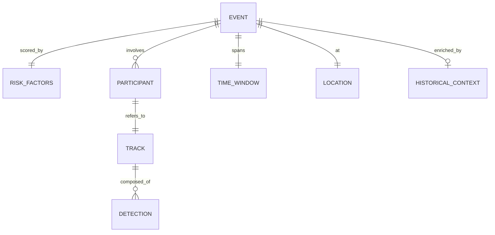

# Data Model

> [!info] Source
> [[PRD]] §18 (core data contract), plus FR-002, FR-003, FR-006, and FR-008.
> Field names below are taken from the §18 JSON exactly — keep them identical to
> the payloads in [[05-API-Contracts]].

## Entities

### Event

| Field | Type | Required | Notes |
|---|---|---|---|
| `event_id` | string | yes | e.g. `nmyc_demo_001` |
| `event_type` | enum | yes | `vehicle_pedestrian_conflict` \| `vehicle_cyclist_conflict` \| `turning_vehicle_vulnerable_user_conflict` (§12) |
| `severity` | enum | yes | `low` \| `medium` \| `high` — derived from the risk proxy and evidence quality, **not** a crash probability (§12) |
| `risk_score` | float | yes | 0–100. Candidate-event threshold is 70 and configurable (FR-007) |
| `risk_factors` | RiskFactors | yes | |
| `participants` | Participant[] | yes | |
| `time_window` | TimeWindow | yes | |
| `location` | Location | yes | |
| `processing_mode` | enum | yes | `live_feed` \| `runtime_analysis` \| `demonstration_replay` (FR-012) |
| `observations` | string[] | yes | Grounded in the evidence package only (FR-010) |
| `historical_context` | HistoricalContext | no | Absent when no location is known |
| `limitations` | string[] | yes | At least one, always (§21.6) |
| `recommended_action` | string | yes | High severity must recommend human review (§21.7) |

> [!warning] Wire value vs UI label
> `processing_mode` is snake_case on the wire and title-case in the UI badge —
> `demonstration_replay` renders as `Demonstration replay`. Exactly one mode is
> active at a time and it must always be visible (FR-012).

### RiskFactors

| Field | Type | Required | Notes |
|---|---|---|---|
| `proximity` | float | yes | 0–1, weight 0.35 |
| `path_overlap` | float | yes | 0–1, weight 0.35 |
| `closing_motion` | float | yes | 0–1, weight 0.20 |
| `vulnerable_user` | float | yes | 0–1, weight 0.10 |

Reference weighting (FR-006). Weights may be tuned against the selected demo
clip, but **every change is recorded in [[05-Decision-Log]]**. An optional
evidence-quality adjustment is permitted.

### Participant

| Field | Type | Required | Notes |
|---|---|---|---|
| `track_id` | int | yes | References a Track |
| `class_name` | string | yes | One of the FR-002 classes |

### TimeWindow

| Field | Type | Required | Notes |
|---|---|---|---|
| `start_seconds` | float | yes | |
| `end_seconds` | float | yes | |

### Location

| Field | Type | Required | Notes |
|---|---|---|---|
| `label` | string | yes | e.g. `Demo intersection` |
| `latitude` | float \| null | yes | Null when unknown — nullable, not omitted |
| `longitude` | float \| null | yes | Null when unknown |

### HistoricalContext

| Field | Type | Required | Notes |
|---|---|---|---|
| `source` | string | yes | e.g. `cached_nyc_open_data` — the fixture case must be labelled as a fixture (§21.10) |
| `nearby_collision_count` | int | yes | |
| `radius_meters` | int | yes | |
| `retrieved_at` | ISO-8601 string | yes | |

Historical context is **external correlation, never causal proof** (§21.8), and
must render visibly separate from evidence observed in the clip (FR-009).

### Detection (FR-002)

| Field | Type | Required | Notes |
|---|---|---|---|
| `class_name` | string | yes | person, bicycle, motorcycle, car, bus, truck |
| `confidence` | float | yes | |
| `bbox` | number[4] | yes | |
| `frame_number` | int | yes | |
| `timestamp` | float | yes | |

### Track (FR-003)

| Field | Type | Required | Notes |
|---|---|---|---|
| `track_id` | int | yes | Stable across frames |
| `class_name` | string | yes | |
| `centroid_history` | point[] | yes | Image-space. **Never presented as real-world metric distance** without calibration (FR-004) |

> [!todo] Three FR-008 fields are not yet named
> FR-008 requires the evidence package to also carry a **representative frame**,
> **annotated clip or overlay data**, and **model/provider metadata**. The §18
> example omits all three, so their field names are not fixed. Name them when
> [[05-API-Contracts]] is written, and add them here — do not guess now.

## Relationships

## Storage

- **Where:** JSON fixtures on disk in `demo/fixtures/`, plus in-memory state for
  the duration of a single request. No database.
- **Persistence needed?** No. A persistent user database is an explicit non-goal
  ([[PRD]] §8) and a prohibited time sink (§25).
- **Retention:** see [[10-Responsible-AI]]. Temporary files are deleted after
  processing where practical (NFR-007); no long-term storage of unnecessary raw
  video (NFR-008).

## Fixture parity

Fixture files in `demo/fixtures/` must match these shapes exactly, or the
deterministic demo diverges from live behaviour. Fixtures are operational
fallbacks, not test data — [[ADR-010-JSON-Fixture-Fallbacks]].

---
Related: [[PRD]] · [[05-API-Contracts]] · [[03-Data-Flow]] · [[ADR-001-Deterministic-Demo-First]] · [[ADR-010-JSON-Fixture-Fallbacks]] · [[10-Responsible-AI]]
