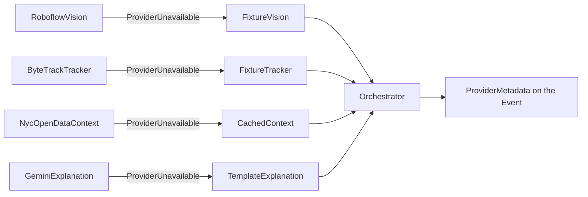

# Provider Adapters

Every external model or data provider sits behind an adapter — rationale in
[[00-Source-of-Truth-PRD|PRD]] §29 ("Provider-adapter architecture"), and the
per-dependency fallback list in FR-015.

The boundary is built. `app/backend/nearmiss/providers/` holds one module per
provider family; `nearmiss/orchestrator.py` is the only caller and owns the
step-down. What is *not* built is stated as such below rather than smoothed over.

## Adapter interface

`nearmiss/providers/base.py` defines **three** `typing.Protocol` classes, each
`@runtime_checkable`, each carrying a `name: str` attribute plus one method:

| Protocol | Method | Returns |
|---|---|---|
| `VisionProvider` | `detect()` | `list[Detection]` |
| `TrackerProvider` | `track(detections)` | `list[Track]` |
| `ContextProvider` | `lookup(latitude, longitude)` | `HistoricalContext` |

`Detection`, `Track` and `HistoricalContext` are the Pydantic models in
`nearmiss/models.py` — see [[06-Data-Model]].

Two things live in the same module:

- **`ProviderUnavailable(provider, reason)`** — the typed decline. Its docstring
  states it carries a user-readable reason and never a stack trace or a secret.
  This is the mechanism behind Rule 4 below.
- **`load_fixture(path)`** — reads a committed JSON fixture. A missing file
  raises `FileNotFoundError`, deliberately *not* `ProviderUnavailable`, so a
  broken fixture fails loudly instead of degrading quietly.

> [!warning] The explanation family has no Protocol
> `GeminiExplanation` and `TemplateExplanation` in
> `nearmiss/providers/explanation.py` share an `explain(candidate, context,
> severity) -> Explanation` signature, but `base.py` declares no
> `ExplanationProvider`. The fourth family is structurally duck-typed while the
> other three are checkable. Adding the Protocol is unbuilt work, not a design
> position.

Runtime and fixture implementations are constructed side by side in
`Orchestrator.__init__`, and each rung is a `try` around the runtime call with
the fixture call in the `except ProviderUnavailable` branch:

`ProviderMetadata` records which implementation actually served each rung, so a
fallback is visible in the payload and not only in the `processing_mode` badge.
`orchestrator.py` sets `runtime_analysis` only when vision *and* tracking both
served live; otherwise `demonstration_replay`. Those two values are drift, not
compliance: FR-016 requires exactly one of five named modes to be active, and
`models.py`'s `ProcessingMode` literal carries three older values, none of which
is one of the five. Renaming them is unbuilt work.

## Registered adapters

| Adapter | Provider | Env var | Fallback | Status |
|---|---|---|---|---|
| `RoboflowVision` (`name = "roboflow"`) | Roboflow hosted inference | `ROBOFLOW_API_KEY`, `ROBOFLOW_MODEL_ID` | `FixtureVision` → `detections.json` | Declines: raises `ProviderUnavailable` for missing key/model, then again for "runtime detection not implemented at P0" |
| `ByteTrackTracker` (`name = "bytetrack"`) | ByteTrack / `supervision`-class tracker | none read | `FixtureTracker` → `tracks.json` | Declines: raises `ProviderUnavailable` unconditionally |
| `NycOpenDataContext` (`name = "nyc_open_data"`) | NYC Open Data | `NYC_OPEN_DATA_APP_TOKEN` | `CachedContext` → `context.json` | Declines: raises `ProviderUnavailable` for missing coordinates, then for "not implemented at P0" |
| `GeminiExplanation` (`name = "gemini"`) | Gemini | `GEMINI_API_KEY` | `TemplateExplanation` | Declines: raises `ProviderUnavailable` for missing key, then for "not implemented at P0" |

Env var names read verbatim from `os.getenv` calls in
`nearmiss/orchestrator.py`. `NycOpenDataContext` is additionally constructed
with `radius_meters=150`, hardcoded at the call site rather than configured.

`nearmiss/config.py`'s `Settings` uses `env_prefix="NEARMISS_"` and defines **no
credential fields at all** — it carries the threshold and risk-calibration knobs
(`alert_threshold`, `high_severity_at`, weights, scales, `fixture_dir`).
Credentials bypass `Settings` entirely.

> [!warning] The fixture rung has code but no data
> `demo/fixtures/` currently contains only `README.md`. `detections.json`,
> `tracks.json` and `context.json` are absent, so `load_fixture` raises
> `FileNotFoundError` today — for context that is caught in `_context` and
> degrades to `None`, but for detection and tracking it is uncaught and the
> pipeline stops. Generating those three files is the P0 gap.

## Rules

1. **Business logic never imports a vendor SDK directly.** Verified: every
   module under `nearmiss/providers/` imports only `json`, `pathlib`,
   `dataclasses`, `typing`, and sibling `nearmiss` modules. No SDK appears
   anywhere in the backend — which is unsurprising while all four runtime
   adapters are unimplemented, so this rule is upheld but not yet tested.
2. **Every adapter has a fixture implementation** — this is what makes
   [[00-Source-of-Truth-PRD|PRD]] §29 achievable. Verifiably satisfied at the
   class level for all four families: `FixtureVision`, `FixtureTracker`,
   `CachedContext`, `TemplateExplanation`. `TemplateExplanation` is the only one
   that is fully real rather than a fixture reader — it composes observations,
   appends `BASELINE_LIMITATIONS` (the two unconditional honesty statements:
   uncalibrated camera, proxy-not-probability), and returns a fixed
   `confidence=0.6`. One drift to fix there: when a `HistoricalContext` is
   present it appends the nearby-collision sentence to `observations`, and
   §23.10 requires public context to stay separate from observed evidence.
3. **Provider selection is configuration, not code.** *Partially true.*
   Credentials are configuration, but which classes are instantiated is
   hardcoded in `Orchestrator.__init__`. There is no registry, no
   provider-name setting, and no fixture-forcing switch — `.env.example`
   advertises `USE_FIXTURES`, and nothing in the backend reads it.
4. **Failures are typed and handled at the adapter boundary, not leaked
   upward.** *Partially satisfied.* The four runtime adapters raise only
   `ProviderUnavailable`, and each of the four `_detect` / `_track` /
   `_context` / `_explain` methods catches it and appends a plain-language
   notice ("Detection fell back to fixtures — …") to `PipelineResult.notices`.
   That caught path is the concrete form of the [[05-API-Contracts]] rule that
   a degraded response is a success with a changed mode, not an error. The
   fixture adapters are the exception: `load_fixture` raises
   `FileNotFoundError`, a second and untyped failure, and only `_context`
   catches it (`orchestrator.py:123`). Raised from `FixtureVision.detect` or
   `FixtureTracker.track` it escapes the orchestrator entirely — the outcome
   described in the callout above.

## Not at this boundary yet

Four gaps, all checked in the source before being listed:

- **No source adapter.** FR-002 is the one that requires an adapter: the fetch
  of a current NYC source image shall go through a provider adapter. FR-001
  requires a server-side registry of approved source records, and FR-003 a
  provenance record on every retrieved frame. None of the three exists — the
  `Source Adapter` node in the §16 architecture diagram has no module, and
  `orchestrator.py` hardcodes `DEMO_LOCATION` with `latitude=None,
  longitude=None`. §11.1's real-source baseline ("At least one approved NYC
  source adapter tested") is unmet.
- **No content-hash / duplicate-frame guard.** §18.4 requires storing a content
  hash to detect duplicate frames, and that a repeated still frame must not be
  treated as new temporal evidence; FR-003 lists content hash as a required
  provenance field. Grep for `hash` across `nearmiss/` returns nothing. This
  belongs on the source adapter, so it is blocked on the item above. §2.4 also
  names "duplicate or stale frames" as one of the conditional Veris scenario
  cases.
- **No provider-readiness surface.** FR-019 requires `GET /health` to report
  provider readiness without exposing secrets. `models.py` defines `Health` and
  `DependencyStatus` for exactly this, but no FastAPI application module exists
  in `app/backend/` — the package is `config`, `models`, `orchestrator`, `risk`
  and `providers/` only.
- **Pairwise scoring is still in-tree.** §29 locks pairwise conflict analysis to
  the pinned `vision-conflict-analytics` package, but `nearmiss/risk.py`
  implements `RiskEngine` inside NearMiss. See
  [[11-Vision-Conflict-Analytics-Package]].

> [!note] Requirement ids in the code are stale
> The docstrings under `nearmiss/` cite FR numbers from a pre-v2.1 numbering —
> `vision.py` says "FR-002, FR-011" for detection and fallbacks, where v2.1.0
> puts detection at FR-005, provider fallbacks at FR-015, FR-002 at real-source
> retrieval and FR-011 at the candidate threshold. Read the PRD, not the
> docstrings, when checking coverage. Renumbering the comments is a mechanical
> follow-up, not a design change.

## Credentials

NFR-010 requires secrets to stay server-side, `.env` to stay uncommitted, and
source URLs containing API keys never to be returned to clients. The adapters
hold credentials as constructor arguments and never place them on the `Event` —
`ProviderMetadata` carries only the four `name` strings.

`.env.example` at the vault root is **stale relative to the code**. It lists
`ANTHROPIC_API_KEY`, `VISION_PROVIDER_API_KEY`, `FEED_API_KEY`, `BACKEND_PORT`,
`FRONTEND_URL` and `USE_FIXTURES`; the backend reads none of these. It should be
replaced with the four names in the table above plus the `NEARMISS_`-prefixed
settings. Sponsor-issued keys tracked in [[03-Sponsor-Resources]].

What the runtime adapters would be pointed at is still open. §30 carries
"Which RF-DETR size or Workflow gives the best tradeoff?" (default: use the
smallest already validated option) and "Which NYC Open Data fields are stable?"
(default: use cached, source-attributed context) — that second default is what
`CachedContext` implements, reached because `NycOpenDataContext` declines.

---
Related: [[00-Source-of-Truth-PRD|PRD]] §29 · [[03-Sponsor-Resources]] · [[02-Live-Feeds]] · [[06-Data-Model]] · [[05-API-Contracts]] · [[11-Vision-Conflict-Analytics-Package]]
