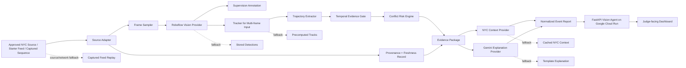

# NearMiss NYC — Source of Truth PRD

> **Product thesis:** Existing NYC street-camera infrastructure should help surface dangerous road-user interactions before those interactions become crash statistics.

> **Hackathon execution contract:** A publicly reachable NearMiss NYC agent deployed on Google Cloud Run is mandatory. The judge-ready core must analyze at least one real NYC feed or organizer-provided live-feed source. A deterministic captured-feed replay remains the guaranteed evidence demonstration and network-failure fallback.

> **Safety claim:** NearMiss NYC calculates an explainable visual conflict-risk proxy. It does not calculate a scientifically validated crash probability, issue legal conclusions, identify individuals, or automate enforcement.

## 1. Document authority

This document is the canonical product and implementation source of truth for NearMiss NYC. When another note, task, prompt, README, design, or implementation decision conflicts with this PRD, this document wins unless a newer approved version explicitly supersedes it.

Changes to the following require an ADR and a PRD version update:

- Product problem or target user
- Cloud Run eligibility contract
- P0 definition of done
- Live-data requirement
- Core event taxonomy
- Risk-scoring semantics
- External-provider boundaries
- Data-source policy
- Safety and privacy requirements
- Required demo flow
- Deployment architecture

### 1.1 Version 2.0 change summary

Version 2.0 makes the following major corrections to version 1.0:

1. Google Cloud Run deployment is promoted from a deployment preference to the only hard eligibility gate.
2. Real-feed analysis is promoted from P2 to P0 because the judging rubric expects a working system on real feeds.
3. Deterministic replay remains mandatory, but it is now a captured-feed evidence demonstration and fallback rather than the only guaranteed product.
4. The approved live-data strategy uses organizer starter feeds, accessible NYC camera still endpoints, or 511NY REST cameras. The system must not depend on signed bulk-feed agreements.
5. Roboflow RF-DETR or a Roboflow Workflow is the preferred perception path. AGPL-licensed Ultralytics YOLO is excluded from the default implementation.
6. Roboflow MCP and Computer Vision Skills are explicitly defined as optional development-plane accelerators, not runtime dependencies.
7. Cloud Run container, public-access, cost, statelessness, concurrency, and port requirements are explicit acceptance criteria.
8. Public repository, README, data provenance, privacy handling, license, and fallback recording are part of P0.

## 2. Hackathon compliance contract

### 2.1 Event

- **Event:** NYC Vision Hack v.2 — Live Feeds, Open Data with Google Cloud, Roboflow, and Veris
- **Date:** Friday, August 7, 2026
- **Event time:** 4:00 PM–10:00 PM America/New_York
- **Build window begins:** approximately 5:15 PM
- **Submission lock:** 8:30 PM
- **Demos:** 8:45 PM
- **Format:** fully in-person
- **Team size:** up to four; solo participation is allowed
- **Theme:** Vision Agents on City Data

### 2.2 Hard eligibility gate

The NearMiss NYC agent shall be deployed on Google Cloud Run before the 8:30 PM submission lock.

The Cloud Run service shall:

- Be publicly reachable without judge authentication
- Return HTTP 200 from `GET /health`
- Expose at least one working live-analysis endpoint
- Identify the deployed revision and active processing mode
- Remain available during the demo window

Failure to satisfy this section means the submission is not hackathon-complete even when the local application works.

### 2.3 Judging alignment

| Judging dimension | NearMiss NYC proof |
|---|---|
| Working Demo | Public Cloud Run agent analyzes a real NYC feed; captured-feed fallback is available |
| NYC Relevance | NYC street safety, NYC camera source, and NYC Open Data context |
| Usefulness or Insight | Surfaces possible road-user conflicts before they become reported crashes |
| Technical Execution | Detection, tracking, transparent risk engine, provenance, fallbacks, structured API |
| Data Craft + Responsibility | Source registry, freshness, privacy boundaries, uncertainty, reproducible fixtures |
| Open Source | Public repository, README, architecture, license, setup, demo, and limitations |

## 3. Product summary

**NearMiss NYC** is an explainable vision agent for NYC street-safety review. It observes a real NYC traffic-camera source, detects relevant road users, derives temporal evidence when enough frames are available, identifies candidate vehicle-to-vulnerable-road-user conflicts, calculates a transparent visual conflict-risk proxy, enriches the event with NYC public-data context, and produces a structured report for human review.

The product has two complementary judge-facing paths:

1. **Live NYC Scan:** fetch and analyze the latest frame or sampled frames from a real NYC source. A no-conflict result is valid and must not be converted into a fabricated alert.
2. **Captured Evidence Replay:** replay a short, source-attributed NYC sequence containing a reproducible candidate conflict so the complete tracking, risk, evidence, and explanation workflow can be demonstrated reliably.

### Product tagline

**See the risk before it becomes a crash statistic.**

### One-sentence pitch

NearMiss NYC turns existing city camera feeds into explainable, privacy-aware early-warning evidence for dangerous vehicle, pedestrian, and cyclist interactions.

## 4. Problem statement

Road-safety decisions frequently rely on lagging indicators such as reported crashes, injuries, fatalities, and complaints. Those records are essential, but they describe harm after it has occurred.

Street-camera footage may contain earlier visual indicators:

- Vehicles and cyclists repeatedly converging at a turn
- Pedestrians entering a conflict zone while vehicles continue moving
- Turning vehicles crossing vulnerable-road-user paths
- Rapidly decreasing image-space separation
- Repeated interactions caused by occlusion or street geometry

Manually reviewing footage is slow, inconsistent, and difficult to scale. Conventional object-detection dashboards usually count objects but do not create event-level evidence, disclose uncertainty, connect observations to public context, or explain why an interaction deserves review.

NearMiss NYC transforms real-feed observations into source-attributed, reviewable candidate-conflict events.

## 5. Product vision

The long-term vision is a city-scale safety-intelligence layer that helps transportation teams discover where risky interactions repeatedly occur, understand why they may occur, and prioritize locations for qualified human investigation.

The hackathon product proves one narrow vertical slice:

1. Connect to one real NYC camera source.
2. Analyze the latest source image or a short sampled sequence.
3. Detect vehicles and vulnerable road users.
4. Derive tracking and trajectory evidence when temporal data is sufficient.
5. Identify or reject one candidate conflict using transparent rules.
6. Visualize the evidence.
7. Add sourced NYC public-data context.
8. Produce an uncertainty-aware human-review report.
9. Run through a public Cloud Run agent.
10. Remain demonstrable through a captured-feed fallback when the live source or venue network fails.

## 6. Target users

### 6.1 Primary hackathon user: transportation-safety analyst

A transportation-safety analyst wants to inspect a candidate conflict, understand why it was flagged, verify the visual evidence, separate observation from historical context, and decide whether the location deserves further investigation.

### 6.2 Secondary users

- Urban planners evaluating intersection design
- Vision Zero and transportation researchers
- Civic-technology teams
- Traffic-operations teams
- Community organizations documenting street-safety concerns

### 6.3 Explicitly excluded users and uses

The hackathon MVP is not designed for:

- Law-enforcement identification or automated enforcement
- Emergency dispatch
- Insurance adjudication
- Individual behavior scoring
- Facial recognition or personal identification
- License-plate recognition
- Demographic inference
- Fully autonomous infrastructure decisions

## 7. Jobs to be done

### Primary job

> When I review an NYC street-safety event, help me understand what was observed, why the interaction may be risky, what evidence supports the alert, how uncertain the result is, and whether the location warrants further human review.

### Supporting jobs

- Verify that the source is a real NYC feed and see when it was fetched.
- Replay the relevant sequence with visible detections and tracks.
- Identify the road-user classes involved.
- Inspect the factors contributing to the risk score.
- Distinguish live observations, derived metrics, historical context, and generated explanation.
- Understand limitations and missing temporal evidence.
- Export a structured event record.

## 8. Goals

### G1 — Clear the Cloud Run eligibility gate

Deploy the agent early and preserve a known-good public revision.

### G2 — Prove real-feed operation

Complete at least one end-to-end analysis using a real NYC source before submission.

### G3 — Deliver a reproducible candidate-conflict demonstration

The captured-feed replay shall demonstrate the full path from frames to evidence-backed report for one supported event.

### G4 — Make the result visually self-explanatory

A judge should understand the involved objects, candidate conflict, risk factors, processing mode, and source within five seconds.

### G5 — Preserve explainability

Every risk score shall be decomposable into visible factors. The LLM/VLM must not originate the risk score.

### G6 — Survive external-service failure

The demo shall remain usable when the live feed, Roboflow hosted service, Gemini, NYC Open Data, or venue internet fails.

### G7 — Use sponsor technology meaningfully

- Google Cloud Run hosts the agent.
- Roboflow provides the primary perception workflow where feasible.
- Gemini may generate a schema-constrained evidence explanation.
- Roboflow MCP may accelerate setup and workflow management during development.

### G8 — Preserve responsible-AI boundaries

Avoid identity inference, biometric analysis, automated enforcement, unsupported metric claims, and unnecessary retention of raw street imagery.

## 9. Non-goals

The hackathon MVP will not:

- Monitor every NYC camera.
- Guarantee uninterrupted real-time citywide operation.
- Depend on an official bulk camera feed requiring a signed agreement.
- Train a new foundation model.
- Train a custom detector before P0 is complete.
- Calculate scientifically validated time-to-collision from an uncalibrated camera.
- Identify people, plates, vehicles, or drivers as individuals.
- Make autonomous enforcement or emergency-response decisions.
- Support authentication, accounts, roles, billing, or subscriptions.
- Build a multi-agent council.
- Build production-grade streaming infrastructure.
- Claim that every candidate event is a true near-miss.
- Recommend definitive civil-engineering changes without expert review.
- Scrape commercial webcam sources whose terms do not clearly permit the use.

## 10. Product principles

1. **Cloud Run first.** The eligibility gate is retired before advanced feature work.
2. **Real feed plus reproducible evidence.** Live analysis proves the connection; captured replay proves the complete event workflow.
3. **Evidence before explanation.** Detection, tracking, trajectory, and risk evidence are produced before language-model narration.
4. **No-event is a valid result.** The live path shall not fabricate a near-miss when none is observed.
5. **Transparent uncertainty.** Source freshness, temporal sufficiency, confidence, limitations, and processing mode are always visible.
6. **One camera and one event beat a citywide mockup.**
7. **Graceful degradation beats hidden failure.** Every fallback is labeled.
8. **No identity layer.** Analyze road-user classes and movement, not identities.
9. **Permissive open-source defaults.** Prefer Apache-2.0 and MIT components.
10. **The agent runtime must not depend on developer tooling.** MCP may configure or inspect Roboflow assets but is not required to serve a request.

## 11. Scope ladder

### 11.1 P0 — Judge-ready core

P0 is the minimum complete submission. Every item below is mandatory unless explicitly marked as an acceptable fallback.

#### Cloud Run and public access

- Public FastAPI agent deployed on Google Cloud Run
- `GET /health` returns HTTP 200
- Service listens on `0.0.0.0:$PORT`
- Public access verified from a logged-out browser or independent device
- Known-good deployed revision preserved

#### Real-feed path

- One configured NYC source from the approved source policy
- Latest source image or short sample retrieved through a source adapter
- Source name, jurisdiction, source URL identifier, retrieval timestamp, and freshness displayed
- Roboflow perception executed on at least one real source image
- Annotated result returned through the Cloud Run service
- Valid no-conflict or insufficient-temporal-evidence state supported

#### Captured evidence path

- One 10–20 second source-attributed NYC sequence or organizer starter-pack sequence
- Precomputed or runtime detections and tracks
- Bounding boxes, labels, trajectory trails, candidate pair, and conflict marker
- One supported potential-conflict event
- Transparent visual conflict-risk score and factor breakdown
- Cached NYC historical context with dataset/source metadata
- Deterministic structured safety report
- Processing mode labeled `Captured feed replay` or `Demonstration fixture`, as applicable

#### Submission artifacts

- Public repository
- README with problem, architecture, data sources, setup, Cloud Run deployment, demo flow, limitations, and privacy handling
- Permissive project license
- Architecture diagram
- Two-minute demo script
- Fallback recording and screenshots stored locally

P0 shall not depend on a signed NYC DOT or 511NY bulk-feed agreement.

### 11.2 P1 — Functional temporal runtime

P1 adds real temporal analysis for an uploaded or captured sequence:

- Roboflow RF-DETR or Workflow inference across sampled frames
- Multi-object tracking
- Image-space trajectory extraction
- Rule-based candidate-pair evaluation
- Runtime visual conflict-risk scoring
- Runtime NYC Open Data lookup
- Gemini schema-constrained explanation
- Cached and deterministic fallbacks
- Processing mode labeled `Runtime sequence analysis`

### 11.3 P2 — Stretch capabilities

P2 may begin only after P0 is frozen and the public Cloud Run revision is preserved.

P2 may include:

- Periodic multi-frame sampling from one live camera
- Multiple camera selection
- Event timeline
- Map markers
- Camera risk ranking
- WebSocket or server-sent progress updates
- Continuous scheduled analysis
- Optional Veris AI scenario testing

Failure to complete P1 or P2 shall not break P0.

## 12. Primary user experience

### 12.1 Default dashboard

The dashboard contains:

- Product thesis and one-sentence explanation
- Source selector limited to approved configured sources
- Source provenance and freshness badge
- Live snapshot or captured replay panel
- Detection and trajectory overlay
- Conflict-point or conflict-region visualization
- Risk-score card
- Risk-factor breakdown
- Temporal-evidence status
- Historical-context card
- Evidence list
- Structured explanation
- Limitations and uncertainty panel
- Processing-mode badge
- System and provider status
- `Analyze live source` and `Replay evidence case` controls

### 12.2 Golden demo flow

The target demo is under two minutes.

1. Open the public dashboard and show the Cloud Run agent URL/status.
2. Point to the selected NYC source, retrieval timestamp, and live-mode badge.
3. Select **Analyze live source**.
4. Show Roboflow detections on the newly retrieved real NYC frame.
5. If the frame lacks enough temporal evidence, show the explicit `Insufficient temporal evidence` state rather than forcing an alert.
6. Select **Replay evidence case**.
7. Show tracked road users and trajectory trails.
8. Show the candidate conflict marker and visual conflict-risk factors.
9. Show sourced NYC historical context.
10. Show the evidence-grounded explanation, limitations, and human-review recommendation.
11. Close with the privacy boundary: no face recognition, plate recognition, identity inference, or automated enforcement.

### 12.3 Required five-second comprehension

Without narration, the UI must answer:

- Is this a live source, runtime sequence, captured replay, or fixture?
- Which NYC source is being analyzed and when was it retrieved?
- What road-user classes are visible?
- Is there enough temporal evidence for conflict analysis?
- What candidate conflict was identified?
- Why was it flagged?
- What uncertainty or limitation applies?

## 13. Event taxonomy

The MVP supports only:

1. `vehicle_pedestrian_conflict`
2. `vehicle_cyclist_conflict`
3. `turning_vehicle_vulnerable_user_conflict`

The first implementation shall optimize for one event type based on the selected evidence sequence.

### Event outcome states

- `no_candidate_conflict`
- `insufficient_temporal_evidence`
- `candidate_conflict_detected`
- `analysis_failed_with_fallback`

### Event severity

- `low`: limited evidence; no escalation
- `medium`: notable visual interaction; optional review
- `high`: strong visual indicators; human review recommended

Severity is derived from the visual conflict-risk proxy and evidence quality. It is not a crash probability.

## 14. Functional requirements

### FR-001 — Source registry

The system shall maintain a server-side registry of approved sources. Each source record shall contain:

- `source_id`
- Display name
- Provider type
- Jurisdiction
- Source category
- Fetch method
- Coordinate or intersection metadata when available
- Attribution text
- Polling/cache policy
- Terms or usage note
- Enabled status

### FR-002 — Real-source retrieval

The system shall fetch at least one current NYC source image through a provider adapter. Credentials and source URLs containing keys must remain server-side.

### FR-003 — Provenance and freshness

Every retrieved frame shall record:

- Retrieval timestamp
- Source-provided timestamp when available
- Source identifier
- Cache status
- Content hash
- Processing revision

The UI shall show whether the content is current, cached, captured, or a fixture.

### FR-004 — Video and sequence input

The system shall accept at least:

- Latest live-source image
- Bundled captured evidence sequence
- Uploaded MP4 as P1
- Periodically sampled live frames as P2

### FR-005 — Detection

The perception pipeline shall detect relevant visible classes:

- Person
- Bicycle
- Motorcycle
- Car
- Bus
- Truck

Each detection shall contain class, confidence, bounding box, frame index, timestamp, and provider metadata.

### FR-006 — Tracking

For multi-frame inputs, the system shall assign track identifiers and store centroid history. Tracking is not required for a single live snapshot.

### FR-007 — Trajectory representation

For stable tracks, the system shall derive image-space trajectory trails and direction/closing-motion proxies. The UI shall not present image-space motion as metric distance or calibrated speed.

### FR-008 — Temporal-evidence gate

The risk engine shall evaluate a candidate conflict only when minimum temporal evidence is available.

The initial gate requires:

- At least two supported road-user tracks
- At least three usable observations per involved track
- Acceptable track continuity
- Non-empty timestamp ordering

When the gate fails, the result shall be `insufficient_temporal_evidence`.

### FR-009 — Candidate-pair filtering

The engine shall evaluate only supported vehicle-to-vulnerable-road-user pairs.

### FR-010 — Visual conflict-risk proxy

The engine shall calculate a normalized 0–100 score using transparent factors:

- Proximity
- Path overlap or convergence
- Closing motion
- Vulnerable-road-user weighting
- Evidence-quality adjustment

Initial reference formula:

```text
base_risk =
  0.35 × proximity
+ 0.35 × path_overlap
+ 0.20 × closing_motion
+ 0.10 × vulnerable_user

risk = base_risk × evidence_quality
```

The score is an image-space prioritization proxy, not a crash probability.

### FR-011 — Candidate threshold

The initial threshold is 70/100 and shall be configurable through server-side settings.

### FR-012 — Evidence package

Every result shall produce an evidence package containing:

- Event or analysis identifier
- Outcome state
- Event type when applicable
- Severity when applicable
- Risk score and factors when applicable
- Involved tracks/classes
- Time window
- Representative frame
- Overlay or annotated-media reference
- Source provenance
- Processing mode
- Model/workflow/provider metadata
- Temporal-evidence status
- Limitations

### FR-013 — Public-data enrichment

When location metadata is available, the system shall load runtime or cached public context such as:

- Nearby reported collisions
- Vulnerable-road-user involvement where available
- Query radius and time window
- Dataset identifier
- Retrieval timestamp

Historical context shall never be presented as evidence observed in the current frame.

### FR-014 — Structured explanation

The explanation provider shall return schema-constrained output containing:

- Outcome summary
- Event classification when applicable
- Severity when applicable
- Explanation confidence
- Evidence-grounded observations
- Historical-context summary
- Limitations
- Recommended next human-review action

The provider shall not invent identities, measurements, legal conclusions, street-design facts, or causal claims.

### FR-015 — Provider fallbacks

Every external dependency shall have a fallback:

- Live source → captured evidence sequence
- Roboflow hosted inference → stored detections or local inference where available
- Tracker runtime → precomputed tracks
- NYC Open Data → cached context
- Gemini → deterministic template explanation
- Primary dashboard → backup recording and screenshots

### FR-016 — Processing-mode disclosure

Exactly one mode shall be active:

- `Live NYC snapshot`
- `Live sampled sequence`
- `Runtime sequence analysis`
- `Captured feed replay`
- `Demonstration fixture`

Fallback operation shall never be represented as live inference.

### FR-017 — No-event behavior

When no candidate event crosses the threshold, the system shall state:

> No candidate conflict crossed the configured visual-risk threshold in the available evidence.

The system shall not manufacture an event.

### FR-018 — Exportable record

The complete normalized analysis record shall be available as JSON.

### FR-019 — Health and readiness

`GET /health` shall return HTTP 200 with:

- Service status
- Version
- Git revision when available
- Environment
- Configured source count
- Provider readiness without exposing secrets

### FR-020 — Roboflow MCP development integration

Roboflow MCP and Computer Vision Skills may be used during development to:

- Inspect or create Roboflow projects
- Discover Universe datasets or models
- Configure or inspect Workflows
- Validate model/workflow identifiers
- Retrieve Roboflow API guidance inside Claude Code, Cursor, or Codex

MCP is not part of the request-serving runtime. The application shall continue to run when the MCP client is disconnected.

## 15. Non-functional requirements

### NFR-001 — Cloud Run container contract

The ingress container shall:

- Listen on `0.0.0.0`
- Read the port from `$PORT`, defaulting to 8080 locally
- Be stateless
- Serve plain HTTP behind Cloud Run TLS termination
- Start within the platform startup window
- Avoid reliance on local persistent storage

### NFR-002 — Public accessibility

The agent shall be public through either:

- `--allow-unauthenticated`, or
- `--no-invoker-iam-check`

A personal-Gmail Google Cloud project is preferred to avoid organization-level domain-restricted-sharing blockers.

### NFR-003 — Deployment strategy

The default deployment is CPU-first. The preferred perception strategy is Roboflow hosted/serverless inference or a lightweight model path, while the orchestration/risk API runs on Cloud Run.

Cloud Run GPU is optional and may be used only after quota and regional availability are verified. P0 shall not depend on GPU availability.

### NFR-004 — Concurrency and request behavior

- Default model-processing concurrency: 1
- Short synchronous analysis is acceptable
- Uploaded/request payloads shall remain below the Cloud Run HTTP/1 body limit
- Long-running continuous video is excluded from P0
- WebSockets/SSE are P2 only and must reconnect before the Cloud Run maximum request duration

### NFR-005 — Reliability

Before submission:

- 10/10 successful local captured-replay runs
- 5/5 successful deployed captured-replay runs
- 3 successful real-source fetches through the deployed service
- 3 successful real-source perception runs where provider credentials permit
- One verified public-access test from an independent browser/device

### NFR-006 — Performance

- Health response target: under 500 ms
- Live source fetch plus perception target: under 20 seconds
- Captured replay begins within 2 seconds
- P1 short-sequence analysis target: under 60 seconds
- Any operation longer than 2 seconds shows progress

### NFR-007 — Type and schema safety

- Python boundaries use Pydantic models.
- TypeScript uses strict mode.
- Frontend API responses are generated from or validated against shared schemas.
- Provider-specific outputs are normalized at adapter boundaries.

### NFR-008 — Failure visibility

Provider failures shall create structured logs and user-readable fallback notices without exposing secrets or stack traces.

### NFR-009 — Accessibility

Critical state shall not be conveyed by color alone. Text labels shall identify risk, mode, source freshness, temporal sufficiency, and service status.

### NFR-010 — Security

- Secrets remain server-side.
- `.env` files are not committed.
- Uploaded files are constrained by type and size.
- Temporary files are deleted after processing when practical.
- Source URLs containing API keys are not returned to clients.

### NFR-011 — Privacy

- No face recognition
- No plate recognition
- No identity or demographic inference
- No re-identification
- No unnecessary long-term raw-video retention
- Stored representative frames should be minimized, source-attributed, and blurred or discarded when retention is not required

### NFR-012 — Cost control

- Use a free-tier Cloud Run region where practical
- Scale to zero
- Do not configure minimum instances for the hackathon
- Set a billing budget alert
- Avoid GPU unless it materially improves a verified bottleneck

## 16. System architecture



### 16.1 Deployment topology

#### Mandatory agent service

- FastAPI
- Google Cloud Run
- Public endpoint
- Source adapters
- Perception adapter
- Risk engine
- Context adapter
- Explanation adapter
- Fixture/captured-replay assets

#### Dashboard

The dashboard may be:

- A Next.js application deployed separately, or
- A lightweight frontend served by the Cloud Run service

The dashboard deployment location is not the eligibility gate. The underlying NearMiss agent must be visibly deployed on Cloud Run.

### 16.2 Runtime request flow

```text
User selects source
→ Cloud Run validates source ID
→ source adapter fetches current image
→ provenance record is created
→ Roboflow inference runs
→ detections are normalized
→ temporal gate determines whether conflict scoring is allowed
→ risk engine returns no-event, insufficient-evidence, or candidate-event result
→ context and explanation providers enrich the evidence
→ normalized report is returned
→ dashboard renders source, evidence, uncertainty, and mode
```

## 17. Recommended stack

### Frontend

- Next.js
- TypeScript strict mode
- Tailwind CSS
- Canvas or SVG overlays
- Lightweight state management only

### Backend

- FastAPI
- Python 3.11+
- Pydantic
- HTTPX
- OpenCV
- Structured JSON logging

### Vision

Preferred order:

1. Roboflow Workflow using an RF-DETR-compatible detection path
2. Roboflow hosted/serverless inference with RF-DETR
3. Local RF-DETR small/nano-compatible path where runtime permits
4. Stored detections for captured replay

Supporting libraries:

- `supervision` for annotation, zones, and normalized detection utilities
- ByteTrack or Roboflow `trackers` for temporal association

### Model and license policy

- Prefer RF-DETR N/S/M/L weights covered by Apache-2.0.
- Prefer MIT or Apache-2.0 supporting libraries.
- Do not make Ultralytics YOLO the default because its AGPL-3.0 obligations complicate a clean permissive submission.
- Do not use restricted RF-DETR Plus weights unless their license is reviewed and accepted.

### AI and data

- Gemini structured output as an optional explanation provider
- NYC Open Data Socrata API
- 511NY REST API where used
- Local JSON fixtures and cached normalized context

### Development-plane tools

- Roboflow MCP server
- Roboflow Computer Vision Skills
- Claude Code, Cursor, or Codex

These tools may configure the perception assets but are not runtime dependencies.

## 18. Approved data-source policy

### 18.1 Approved primary sources

Use one of the following, in order:

1. Organizer-provided starter-pack live camera source
2. Publicly reachable NYC DOT traffic-camera still-image endpoint with polite caching
3. 511NY REST camera endpoint using a self-service developer key
4. A phone or USB webcam physically operating in NYC as an emergency live-input demonstration

### 18.2 Approved enrichment sources

- NYC Open Data Socrata datasets, including collision and 311 datasets where relevant
- 511NY REST incidents/roadwork when relevant
- MTA GTFS-realtime as a P2 contextual source

### 18.3 Prohibited P0 dependencies

P0 shall not depend on:

- NYC DOT bulk camera feeds requiring a signed data-sharing agreement
- 511NY bulk feeds requiring a Developer Access Agreement
- Third-party commercial webcam scraping
- An undocumented endpoint without a source/usage note
- A source whose availability cannot be tested before the demo

### 18.4 Polling and caching

- Respect the source-specific polling policy.
- For 511NY REST, remain within the documented request throttle.
- Cache source metadata and avoid repeatedly fetching unchanged images.
- Store a content hash to detect duplicate frames.
- A repeated still frame must not be treated as new temporal evidence.

### 18.5 Source disclosure

The README and dashboard shall state:

- Source/provider name
- Source category
- Retrieval method
- Whether the content is current, cached, captured, or fixture data
- Attribution
- Known usage limitation
- Retrieval timestamp

## 19. Risk semantics

### 19.1 Visual conflict-risk proxy

The proxy ranks image-space evidence for human review. It is not:

- A crash probability
- A calibrated time-to-collision metric
- A legal finding
- A traffic violation determination
- A causal infrastructure diagnosis

### 19.2 Evidence-quality factor

The evidence-quality adjustment may consider:

- Number of usable frames
- Track continuity
- Detection confidence
- Occlusion
- Duplicate/repeated frames
- Camera stability

Low evidence quality shall reduce the score or prevent scoring entirely.

### 19.3 Human-review requirement

Every high-severity candidate event shall recommend human review. The application shall not automatically contact enforcement, dispatch, or issue a 311 report.

## 20. Core data contract

```json
{
  "analysis_id": "nmyc_live_20260807_001",
  "outcome": "candidate_conflict_detected",
  "event_type": "vehicle_cyclist_conflict",
  "severity": "high",
  "risk_score": 84.0,
  "risk_factors": {
    "proximity": 0.88,
    "path_overlap": 0.91,
    "closing_motion": 0.72,
    "vulnerable_user": 1.0,
    "evidence_quality": 0.94
  },
  "participants": [
    {"track_id": 12, "class_name": "truck"},
    {"track_id": 19, "class_name": "bicycle"}
  ],
  "time_window": {
    "start_seconds": 4.2,
    "end_seconds": 6.1
  },
  "source": {
    "source_id": "nyc_camera_demo_001",
    "display_name": "Configured NYC traffic camera",
    "provider": "organizer_starter_or_city_camera",
    "jurisdiction": "New York City",
    "retrieved_at": "2026-08-07T23:12:00Z",
    "source_timestamp": null,
    "freshness_seconds": 8,
    "cache_status": "miss",
    "content_hash": "sha256:..."
  },
  "location": {
    "label": "Configured demo intersection",
    "latitude": null,
    "longitude": null
  },
  "processing_mode": "captured_feed_replay",
  "temporal_evidence": {
    "sufficient": true,
    "frame_count": 42,
    "duplicate_frame_count": 0,
    "track_continuity": 0.93
  },
  "observations": [
    "The two image-space paths converge.",
    "Visual separation decreases across consecutive frames."
  ],
  "historical_context": {
    "source": "cached_nyc_open_data",
    "dataset_id": "configured-dataset-id",
    "nearby_collision_count": 12,
    "radius_meters": 150,
    "retrieved_at": "2026-08-04T23:00:00Z"
  },
  "model": {
    "provider": "roboflow",
    "model_or_workflow_id": "configured-server-side",
    "revision": "configured-revision"
  },
  "limitations": [
    "The camera is not geometrically calibrated.",
    "The score is a visual conflict-risk proxy, not a crash probability."
  ],
  "recommended_action": "Review the event and examine whether similar interactions recur at this location."
}
```

## 21. API requirements

### `GET /health`

Returns service status, version, revision, environment, configured-source count, and provider readiness.

### `GET /api/v1/sources`

Returns public source metadata without credentials or secret-bearing URLs.

### `POST /api/v1/live/{source_id}/analyze`

Fetches the latest approved source image, records provenance, runs perception, applies the temporal-evidence gate, and returns a normalized analysis.

### `GET /api/v1/demo`

Returns the deterministic captured-feed replay record and media references.

### `POST /api/v1/analyze`

P1 endpoint for a short uploaded video or trusted input reference.

### `GET /api/v1/events/{analysis_id}`

Returns the normalized analysis record.

### `GET /api/v1/artifacts/{analysis_id}`

Returns or redirects to approved annotated artifacts. Raw source media shall not be exposed by default.

A queue, persistent database, user account, and authentication system are not required.

## 22. User-interface requirements

### Required components

- `SourceSelector`
- `SourceProvenance`
- `FreshnessBadge`
- `LiveSnapshot`
- `CapturedReplay`
- `DetectionOverlay`
- `TrajectoryOverlay`
- `TemporalEvidenceStatus`
- `RiskScoreCard`
- `RiskFactorBreakdown`
- `EventEvidence`
- `HistoricalContext`
- `ExplanationPanel`
- `LimitationsPanel`
- `ProcessingModeBadge`
- `SystemStatus`

### Required states

- Initial
- Fetching source
- Running perception
- Completed with no conflict
- Completed with insufficient temporal evidence
- Candidate conflict detected
- Completed with fallback
- Source unavailable
- Failed input

### Required labels

The UI shall never use `Live` without a retrieval timestamp and source identifier.

## 23. Responsible data and AI requirements

1. No face recognition or personal identification.
2. No plate recognition.
3. No demographic inference.
4. No re-identification.
5. No autonomous enforcement recommendation.
6. No claim that the proxy equals collision probability.
7. Every report exposes limitations.
8. Every high-severity event recommends human review.
9. Historical correlation is not causal proof.
10. Observed evidence, derived metrics, public context, and generated explanation remain separate.
11. Captured and fixture assets are labeled accurately.
12. Raw media is retained only when necessary for reproducibility and permitted by the source policy.
13. Public artifacts shall avoid unnecessary exposure of faces and plates.
14. Source attribution and retrieval timestamp are visible.
15. No-event and insufficient-evidence outcomes are acceptable.

## 24. Evaluation plan

### 24.1 Rubric-aligned acceptance matrix

| Rubric | Test |
|---|---|
| Working Demo | Public Cloud Run URL completes a live-source analysis and captured replay |
| NYC Relevance | Configured source and enrichment are NYC-specific and visibly attributed |
| Usefulness | Judge can explain the review decision supported by the event evidence |
| Technical Execution | Provider adapters, temporal gate, risk engine, schemas, fallbacks, and logs work |
| Data Responsibility | Freshness, source, limitations, privacy, and processing mode are visible |
| Open Source | Clean public repo, README, license, setup, architecture, and reproducible fixture |

### 24.2 Vision evaluation

For the selected evidence sequence:

- Required classes are detected in key frames.
- Track identities remain stable through the conflict window.
- Trajectory trails align visually with objects.
- Representative frame clearly shows the event.
- Stored and runtime outputs use the same normalized schema.

### 24.3 Live-source evaluation

- Source fetch succeeds three consecutive times.
- Retrieval timestamp changes when content changes.
- Duplicate frames are detected by hash.
- Source outage triggers a visible fallback.
- Single-frame input returns `insufficient_temporal_evidence` rather than a fabricated event.

### 24.4 Risk-engine evaluation

Test at least:

- Converging vehicle–cyclist paths
- Converging vehicle–pedestrian paths
- Parallel movement without convergence
- Stationary pedestrian near a vehicle
- Temporary overlap caused by detection jitter
- Missing or unstable track
- Duplicate frames
- Insufficient frame count

### 24.5 Explanation evaluation

The explanation shall:

- Reference supplied evidence only
- Avoid identity, legal, and metric claims
- Include at least one limitation
- Recommend human review when appropriate
- Produce valid schema-constrained output

### 24.6 Reliability evaluation

Test:

- All providers available
- Live source unavailable
- Roboflow unavailable
- Gemini unavailable
- NYC Open Data unavailable
- Internet unavailable after initial load
- Corrupt upload
- Unsupported format
- No candidate conflict
- Insufficient temporal evidence
- Public Cloud Run access from logged-out browser

## 25. Success metrics

### Product metrics

- One real NYC source analyzed through the public agent
- One complete captured conflict report generated
- Judge understands the problem and output without deep explanation
- Risk score visibly decomposed
- Source, freshness, and mode visibly disclosed
- One meaningful, sourced public-data context card displayed
- No fabricated live alert

### Engineering metrics

- Cloud Run eligibility gate: passed
- Public demo URL: working
- P0 deployed-run success: 100% during pre-demo checks
- Unhandled golden-path exceptions: 0
- External provider without fallback: 0
- Dead or misleading controls: 0
- Secrets committed: 0
- Privacy-policy violations in published artifacts: 0

### Hackathon success indicators

- Submission delivered before 8:30 PM on August 7, 2026
- Live NYC feed proof shown
- Clear two-minute narrative
- Roboflow perception demonstrated
- Public repository and README ready
- Responsible-data limitations explicitly stated

Winning is an aspiration, not an acceptance criterion.

## 26. Definition of done

NearMiss NYC is hackathon-complete only when all P0 conditions are satisfied:

- [ ] Agent is deployed on Google Cloud Run.
- [ ] Agent is publicly reachable without authentication.
- [ ] `GET /health` returns HTTP 200.
- [ ] Service binds to `0.0.0.0:$PORT`.
- [ ] A real NYC source is configured and attributed.
- [ ] The deployed service has fetched and analyzed the real source successfully.
- [ ] Live-source result shows source, retrieval time, freshness, provider, and processing mode.
- [ ] A valid no-conflict or insufficient-evidence state is implemented.
- [ ] Captured evidence sequence plays correctly.
- [ ] Bounding boxes and trajectory trails are visible in the evidence case.
- [ ] One supported candidate conflict is highlighted.
- [ ] Risk score and factor breakdown are displayed.
- [ ] Cached or runtime historical context is displayed and sourced.
- [ ] Structured explanation and limitations are displayed.
- [ ] Every fallback is labeled.
- [ ] Core captured-replay demo works without runtime external APIs.
- [ ] Public repo includes README, architecture, deployment instructions, source policy, privacy boundaries, and demo instructions.
- [ ] A permissive license is present.
- [ ] Backup recording and screenshots exist locally.
- [ ] Presenter can complete the golden demo in under two minutes.
- [ ] Submission artifacts are ready before 8:15 PM, leaving buffer before the 8:30 PM lock.

## 27. Execution plan

### 27.1 Before Friday, August 7, 2026

1. Use a personal Gmail Google Cloud account.
2. Enable billing.
3. Enable Cloud Run, Cloud Build, and Artifact Registry APIs.
4. Install and authenticate `gcloud`.
5. Deploy a public FastAPI health skeleton.
6. Verify the public URL from a logged-out browser.
7. Create a Roboflow account and obtain the API key.
8. Connect Roboflow MCP to the selected coding agent.
9. Install Roboflow Computer Vision Skills.
10. Obtain a 511NY REST key if that source is selected.
11. Obtain a Socrata app token.
12. Pre-download or cache required model assets where permitted.
13. Validate one approved NYC source.
14. Prepare a captured evidence sequence and normalized fixtures.
15. Prepare README and license skeletons.
16. Bring laptop, charger, phone/webcam, and hotspot.

### 27.2 Event execution timeline

#### 4:00–5:15 PM — setup and workshop

- Check in.
- Obtain organizer starter pack.
- Confirm source legality and availability.
- Use the Cloud Run workshop to verify deployment.

#### 5:15–5:35 PM — clear eligibility gate

- Deploy `/health` and minimal live-source endpoint.
- Verify public access.
- Tag or record the known-good revision.

#### 5:35–6:15 PM — real-feed perception

- Fetch one real NYC source image.
- Run Roboflow inference.
- Return normalized detections and annotated frame.
- Display provenance and freshness.

#### 6:15–7:00 PM — evidence replay

- Integrate captured sequence.
- Add tracking, trajectories, temporal gate, and risk factors.
- Validate the one target event.

#### 7:00–7:40 PM — context and explanation

- Add cached/runtime NYC context.
- Add template explanation.
- Add Gemini only when the template path is stable.

#### 7:40–8:00 PM — dashboard and README

- Complete visual hierarchy.
- Verify mode labels and limitations.
- Finalize README, architecture, data sources, and license.

#### 8:00 PM — scope freeze

- Preserve the deployed revision.
- Add no new core feature.
- Run demo reliability checks.
- Record fallback demo.

#### 8:15 PM — submission-ready target

- Prepare submission fields and URLs.
- Verify public repo and Cloud Run URL.
- Keep fifteen minutes of buffer before the 8:30 PM lock.

## 28. Major risks and mitigations

| Risk | Impact | Mitigation |
|---|---|---|
| Not deployed on Cloud Run | Disqualification | Deploy health skeleton first and preserve revision |
| Public access blocked by organization policy | Disqualification | Use personal Gmail or `--no-invoker-iam-check` |
| Container binds to localhost/wrong port | High | Bind to `0.0.0.0:$PORT`; test locally and deployed |
| Live source unavailable | High | Organizer source, alternate approved source, captured replay |
| Official feed requires signed agreement | High | Do not depend on bulk feed; use approved accessible REST/still source |
| No near-miss occurs live | High | Treat no-event as valid; use captured evidence case for full workflow |
| Duplicate camera stills create false motion | High | Content hashing and temporal-evidence gate |
| Detection misses cyclist/pedestrian | High | Validate source/sequence early; stored detections fallback |
| Tracking identity switches | Medium | Short sequence, smoothing, precomputed tracks |
| Perspective invalidates metric claims | High | Use image-space proxy and explicit limitations |
| Roboflow latency or credit failure | Medium | Stored detections/local fallback; limit calls |
| Gemini fails or hallucinates | High | Schema constraints and deterministic template |
| NYC API fails | Medium | Cached normalized context |
| Rooftop Wi-Fi fails | High | Personal hotspot, captured replay, local recording |
| UI consumes excessive time | Medium | One dashboard, no auth, fixture-first |
| Privacy sloppiness | High | No identity features, minimize retention, source/privacy disclosure |
| License conflict | Medium | RF-DETR + MIT/Apache defaults; avoid AGPL default |

## 29. Locked architectural decisions

The following are approved for version 2.0:

- Public Google Cloud Run agent is mandatory.
- Real NYC feed analysis is part of P0.
- Captured-feed evidence replay is the guaranteed conflict demonstration and fallback.
- A live no-conflict result is valid.
- Visual conflict-risk proxy, not true collision probability.
- Provider-adapter architecture.
- One orchestrated pipeline, not a multi-agent council.
- No authentication.
- No identity recognition.
- FastAPI backend.
- Next.js dashboard is preferred but not allowed to endanger the Cloud Run agent.
- Roboflow RF-DETR/Workflow is the preferred perception provider.
- `supervision` and a lightweight tracker are preferred post-processing tools.
- Roboflow MCP is a development-plane integration, not runtime infrastructure.
- CPU-first Cloud Run strategy; GPU is optional.
- Approved accessible camera endpoints or organizer feeds; no signed bulk-feed dependency.
- JSON fixtures and captured assets are operational fallbacks.
- Public repo, README, source policy, privacy statement, and permissive license are P0.

## 30. Open questions

These may be resolved during the event without changing the product thesis:

- Which organizer or city camera source is most reliable?
- Does the selected camera update frequently enough for multi-frame temporal analysis?
- Which RF-DETR size or Roboflow Workflow gives the best latency/accuracy tradeoff?
- Which exact intersection and coordinates correspond to the captured evidence sequence?
- Which NYC Open Data dataset fields are stable enough for runtime enrichment?
- Whether the dashboard is served separately or by the agent service
- Whether the event provides a mandatory starter repository or submission format
- Whether Veris AI offers a useful optional test flow within remaining time

Event-specific overrides shall be recorded in the decision log and reflected in the next PRD version.

## 31. Change-control protocol

A PRD change shall include:

1. Proposed change
2. Reason
3. Impact on P0/P1/P2
4. New risks
5. Acceptance-criteria update
6. ADR reference when architectural
7. Version increment

### Versioning

- **Patch:** wording, clarification, or non-behavioral correction
- **Minor:** additive requirement that does not redefine P0
- **Major:** product thesis, safety boundary, architecture, eligibility contract, or P0 change

## 32. Requirement provenance

This revision is grounded in:

- The original NearMiss NYC Source-of-Truth PRD version 1.0.0
- The NYC Vision Hack v.2 Roboflow and event preparation brief
- The NYC Vision Hack v.2 compliance checklist

Where these materials distinguish organizer-stated requirements, platform constraints, and inferred best practices, this PRD treats them as follows:

- **Organizer-stated:** Cloud Run eligibility gate, schedule, real-feed demo expectation, judging dimensions, open-source emphasis
- **Platform constraints:** Cloud Run public access, port binding, statelessness, request behavior, data-source access, API throttling
- **Execution best practices:** personal-Gmail GCP project, CPU-first deployment, captured fallback, hotspot, source registry, privacy disclosure, scope freeze

---

# Final product contract

NearMiss NYC succeeds when a public Google Cloud Run agent analyzes a real NYC source, truthfully reports whether enough evidence exists for conflict analysis, and demonstrates one reproducible captured candidate-conflict event with clear visual evidence, a transparent non-scientific risk proxy, sourced NYC context, explicit uncertainty, and a human-review recommendation.

The project shall remain demonstrable when every external dependency fails, but it shall not represent fallback output as live analysis.
