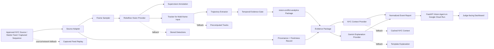

# NearMiss NYC — Source of Truth PRD

> **Product thesis:** Existing NYC street-camera infrastructure should help surface dangerous road-user interactions before those interactions become crash statistics.

> **Hackathon execution contract:** A publicly reachable NearMiss NYC agent deployed on Google Cloud Run is mandatory. The judge-ready core must analyze at least one real NYC feed or organizer-provided live-feed source. A deterministic captured-feed replay remains the guaranteed evidence demonstration and network-failure fallback.

> **Safety claim:** NearMiss NYC calculates an explainable visual conflict-risk proxy. It does not calculate a scientifically validated crash probability, issue legal conclusions, identify individuals, or automate enforcement.

## 1. Document authority

This document is the canonical product and implementation source of truth for NearMiss NYC. When another note, task, prompt, README, design, or implementation decision conflicts with this PRD, this document wins unless a newer approved version explicitly supersedes it.

Changes to the following require an ADR and a PRD version update:

- Product problem or target user
- Cloud Run eligibility contract
- P0 definition of done
- Live-data requirement
- Core event taxonomy
- Risk-scoring semantics
- External-provider boundaries
- Data-source policy
- Safety and privacy requirements
- Required demo flow
- Deployment architecture

### 1.1 Version 2.0 change summary

Version 2.0 makes the following major corrections to version 1.0:

1. Google Cloud Run deployment is promoted from a deployment preference to the only hard eligibility gate.
2. Real-feed analysis is promoted from P2 to P0 because the judging rubric expects a working system on real feeds.
3. Deterministic replay remains mandatory, but it is now a captured-feed evidence demonstration and fallback rather than the only guaranteed product.
4. The approved live-data strategy uses organizer starter feeds, accessible NYC camera still endpoints, or 511NY REST cameras. The system must not depend on signed bulk-feed agreements.
5. Roboflow RF-DETR or a Roboflow Workflow is the preferred perception path. AGPL-licensed Ultralytics YOLO is excluded from the default implementation.
6. Roboflow MCP and Computer Vision Skills are explicitly defined as optional development-plane accelerators, not runtime dependencies.
7. Cloud Run container, public-access, cost, statelessness, concurrency, and port requirements are explicit acceptance criteria.
8. Public repository, README, data provenance, privacy handling, license, and fallback recording are part of P0.

### 1.2 Version 2.1 correction summary

Version 2.1 closes seven execution and governance gaps identified during review:

1. Veris AI receives an explicit, conditional integration strategy without inventing an unconfirmed prize track or making Veris a runtime dependency.
2. The event-day plan is rebuilt around a pre-event readiness gate, a 7:00 PM code freeze, and at least 75 minutes reserved for reliability, recording, submission, and contingency.
3. P0 is divided into artifacts that must exist before arrival and the small event-day integration delta; tracking, trajectories, normalized fixtures, README scaffolding, and the captured evidence case are not event-day construction tasks.
4. Event facts are tied to source documents stored inside the vault, with organizer-stated requirements separated from platform constraints, research findings, and execution inferences.
5. Superseding ADRs formally replace the v1 deterministic-only P0 decision and any prior Cloud Run decision that treated deployment as optional or sponsor-only.
6. The mandatory UI surface is reduced from sixteen separately named components to six judge-facing surfaces; implementation may still use smaller internal components.
7. Runtime NYC enrichment and Gemini generation are P1. P0 uses cached, source-attributed context and a deterministic evidence-grounded explanation.

### 1.3 Final stabilization patch — no version increment

The final pre-event stabilization patch remains version **2.1.0** and adds no new product scope:

1. The pairwise trajectory and conflict-scoring engine is extracted into the public, permissively licensed `vision-conflict-analytics` Python package. NearMiss NYC consumes a pinned release rather than owning the reusable primitive as private application logic.
2. The package exposes tracked-object interaction analysis as a domain-neutral API that can support traffic conflicts, forklift–worker proximity, construction safety, robotics, and other asymmetric class-pair use cases.
3. A Roboflow Workflow/community-plugin wrapper is explicitly post-P0; the hackathon artifact is the standalone tested library and its use inside NearMiss.
4. Prepared code is disclosed in the public README. The disclosure separates pre-event scaffolding, reusable components, fixtures, and event-day integration work.
5. Roboflow account creation and API-key validation move to Tuesday, August 4 because they are dependencies for Wednesday evidence work.
6. This PRD is frozen after this patch. Organizer-driven changes and implementation choices shall be recorded in `08-Execution/05-Decision-Log.md`; no version 2.2 is planned before the event.

## 2. Hackathon compliance contract

### 2.1 Event facts and source status

| Claim | Status in this PRD | Vault source |
|---|---|---|
| Event is Friday, August 7, 2026, 4:00–10:00 PM | Organizer-page-derived; re-check after sign-in | [[01-Event/05-Roboflow-and-Event-Preparation-Brief]] |
| Build period begins around 5:15 PM | Organizer-page-derived | [[01-Event/05-Roboflow-and-Event-Preparation-Brief]] |
| Submission locks at 8:30 PM and demos begin at 8:45 PM | Organizer-page-derived | [[01-Event/05-Roboflow-and-Event-Preparation-Brief]]; [[01-Event/06-Hackathon-Compliance-Checklist]] |
| Teams may contain up to four people and solo builders are allowed | Organizer-page-derived | [[01-Event/05-Roboflow-and-Event-Preparation-Brief]] |
| The only stated eligibility gate is deployment on Google Cloud Run | Organizer-stated according to retrieved registration material | [[01-Event/06-Hackathon-Compliance-Checklist]] |
| Judging covers Working Demo, NYC Relevance, Usefulness/Insight, Technical Execution, Data Craft + Responsibility, and Open Source | Organizer-page-derived | [[01-Event/05-Roboflow-and-Event-Preparation-Brief]]; [[01-Event/06-Hackathon-Compliance-Checklist]] |
| Veris AI is a co-host | Source-supported | [[01-Event/05-Roboflow-and-Event-Preparation-Brief]] |
| Veris has a dedicated prize track or mandatory integration | **Unverified; do not claim** | No confirming source in the vault |

The exact submission form, demo duration, final judge list, Veris-specific prize terms, and any kickoff overrides remain unverified until organizer confirmation. A same-day organizer update supersedes this table and must be recorded in `08-Execution/05-Decision-Log.md`.

### 2.2 Hard eligibility gate

The NearMiss NYC agent shall be deployed on Google Cloud Run before the 8:30 PM submission lock.

The Cloud Run service shall:

- Be publicly reachable without judge authentication
- Return HTTP 200 from `GET /health`
- Expose at least one working real-source analysis endpoint
- Identify the deployed revision and active processing mode
- Remain available during the demo window

Failure to satisfy this section means the submission is not hackathon-complete even when the local application works.

### 2.3 Judging alignment

| Judging dimension | NearMiss NYC proof |
|---|---|
| Working Demo | Public Cloud Run agent analyzes a real NYC source; captured-feed fallback is available |
| NYC Relevance | NYC street safety, NYC camera source, and NYC Open Data context |
| Usefulness or Insight | Surfaces possible road-user conflicts before they become reported crashes |
| Technical Execution | Detection, tracking evidence, transparent risk engine, provenance, fallbacks, and structured API |
| Data Craft + Responsibility | Source registry, freshness, privacy boundaries, uncertainty, and reproducible fixtures |
| Open Source | Public repository, README, architecture, license, setup, demo, and limitations |

### 2.4 Sponsor and co-host integration policy

#### Google Cloud

Google Cloud Run is mandatory infrastructure and is part of P0. Gemini is optional P1 and shall never replace the deterministic P0 explanation.

#### Roboflow

Roboflow is the preferred perception provider. P0 shall demonstrate Roboflow inference on at least one real NYC frame when credentials and service availability permit. Stored normalized detections remain the fallback for the captured evidence case.

NearMiss shall also expose its pairwise interaction logic as a separate public package, `vision-conflict-analytics`, under a permissive license. The package receives normalized tracked detections and returns candidate interacting pairs, decomposed factor scores, evidence sufficiency, and an optional predicted image-space intersection. NearMiss consumes a pinned package release. A Roboflow Workflow block or community-plugin wrapper is a post-P0 contribution path, not a dependency for the Friday submission.

#### Veris AI

Veris is treated as a **conditional evaluation-plane integration**, not an assumed runtime dependency.

Before the event, or no later than kickoff, the team shall ask:

1. Is there a Veris-specific prize, judging dimension, or required artifact?
2. Can Veris run scenario tests against a public HTTP agent within the remaining time?
3. Is there an SDK, starter project, account, or credit requirement that must be prepared?

If Veris support is confirmed and a tested integration can be completed without consuming contingency time, NearMiss may submit a small scenario pack covering:

- Live source unavailable
- Duplicate or stale frames
- No candidate conflict
- Insufficient temporal evidence
- Roboflow or enrichment provider failure

The artifact should be a test result, screenshot, or machine-readable report proving graceful degradation. If Veris requirements are unconfirmed, unavailable, or require more than 30 minutes of untested work, the integration is skipped. The absence of Veris must not endanger Cloud Run eligibility, the real-source path, the captured evidence replay, or submission readiness.

## 3. Product summary

**NearMiss NYC** is an explainable vision agent for NYC street-safety review. It observes a real NYC traffic-camera source, detects relevant road users, derives temporal evidence when enough frames are available, identifies candidate vehicle-to-vulnerable-road-user conflicts, calculates a transparent visual conflict-risk proxy, enriches the event with NYC public-data context, and produces a structured report for human review.

The product has two complementary judge-facing paths:

1. **Live NYC Scan:** fetch and analyze the latest frame or sampled frames from a real NYC source. A no-conflict result is valid and must not be converted into a fabricated alert.
2. **Captured Evidence Replay:** replay a short, source-attributed NYC sequence containing a reproducible candidate conflict so the complete tracking, risk, evidence, and explanation workflow can be demonstrated reliably.

### Product tagline

**See the risk before it becomes a crash statistic.**

### One-sentence pitch

NearMiss NYC turns existing city camera feeds into explainable, privacy-aware early-warning evidence for dangerous vehicle, pedestrian, and cyclist interactions.

## 4. Problem statement

Road-safety decisions frequently rely on lagging indicators such as reported crashes, injuries, fatalities, and complaints. Those records are essential, but they describe harm after it has occurred.

Street-camera footage may contain earlier visual indicators:

- Vehicles and cyclists repeatedly converging at a turn
- Pedestrians entering a conflict zone while vehicles continue moving
- Turning vehicles crossing vulnerable-road-user paths
- Rapidly decreasing image-space separation
- Repeated interactions caused by occlusion or street geometry

Manually reviewing footage is slow, inconsistent, and difficult to scale. Conventional object-detection dashboards usually count objects but do not create event-level evidence, disclose uncertainty, connect observations to public context, or explain why an interaction deserves review.

NearMiss NYC transforms real-feed observations into source-attributed, reviewable candidate-conflict events.

## 5. Product vision

The long-term vision is a city-scale safety-intelligence layer that helps transportation teams discover where risky interactions repeatedly occur, understand why they may occur, and prioritize locations for qualified human investigation.

The hackathon product proves one narrow vertical slice:

1. Connect to one real NYC camera source.
2. Analyze the latest source image or a short sampled sequence.
3. Detect vehicles and vulnerable road users.
4. Derive tracking and trajectory evidence when temporal data is sufficient.
5. Identify or reject one candidate conflict using transparent rules.
6. Visualize the evidence.
7. Add sourced NYC public-data context.
8. Produce an uncertainty-aware human-review report.
9. Run through a public Cloud Run agent.
10. Remain demonstrable through a captured-feed fallback when the live source or venue network fails.

## 6. Target users

### 6.1 Primary hackathon user: transportation-safety analyst

A transportation-safety analyst wants to inspect a candidate conflict, understand why it was flagged, verify the visual evidence, separate observation from historical context, and decide whether the location deserves further investigation.

### 6.2 Secondary users

- Urban planners evaluating intersection design
- Vision Zero and transportation researchers
- Civic-technology teams
- Traffic-operations teams
- Community organizations documenting street-safety concerns

### 6.3 Explicitly excluded users and uses

The hackathon MVP is not designed for:

- Law-enforcement identification or automated enforcement
- Emergency dispatch
- Insurance adjudication
- Individual behavior scoring
- Facial recognition or personal identification
- License-plate recognition
- Demographic inference
- Fully autonomous infrastructure decisions

## 7. Jobs to be done

### Primary job

> When I review an NYC street-safety event, help me understand what was observed, why the interaction may be risky, what evidence supports the alert, how uncertain the result is, and whether the location warrants further human review.

### Supporting jobs

- Verify that the source is a real NYC feed and see when it was fetched.
- Replay the relevant sequence with visible detections and tracks.
- Identify the road-user classes involved.
- Inspect the factors contributing to the risk score.
- Distinguish live observations, derived metrics, historical context, and generated explanation.
- Understand limitations and missing temporal evidence.
- Export a structured event record.

## 8. Goals

### G1 — Clear the Cloud Run eligibility gate

Deploy the agent early and preserve a known-good public revision.

### G2 — Prove real-feed operation

Complete at least one end-to-end analysis using a real NYC source before submission.

### G3 — Deliver a reproducible candidate-conflict demonstration

The captured-feed replay shall demonstrate the full path from frames to evidence-backed report for one supported event.

### G4 — Make the result visually self-explanatory

A judge should understand the involved objects, candidate conflict, risk factors, processing mode, and source within five seconds.

### G5 — Preserve explainability

Every risk score shall be decomposable into visible factors. The LLM/VLM must not originate the risk score.

### G6 — Survive external-service failure

The demo shall remain usable when the live feed, Roboflow hosted service, Gemini, NYC Open Data, or venue internet fails.

### G7 — Use sponsor and co-host technology proportionally

- Google Cloud Run hosts the agent and clears the eligibility gate.
- Roboflow provides the primary perception workflow where feasible.
- Gemini may generate a schema-constrained evidence explanation only after the deterministic explanation is stable.
- Roboflow MCP may accelerate setup and workflow management during development.
- Veris may execute a bounded reliability scenario pack only when the integration path and event value are confirmed.

### G8 — Preserve responsible-AI boundaries

Avoid identity inference, biometric analysis, automated enforcement, unsupported metric claims, and unnecessary retention of raw street imagery.

## 9. Non-goals

The hackathon MVP will not:

- Monitor every NYC camera.
- Guarantee uninterrupted real-time citywide operation.
- Depend on an official bulk camera feed requiring a signed agreement.
- Train a new foundation model.
- Train a custom detector before P0 is complete.
- Calculate scientifically validated time-to-collision from an uncalibrated camera.
- Identify people, plates, vehicles, or drivers as individuals.
- Make autonomous enforcement or emergency-response decisions.
- Support authentication, accounts, roles, billing, or subscriptions.
- Build a multi-agent council.
- Build production-grade streaming infrastructure.
- Claim that every candidate event is a true near-miss.
- Recommend definitive civil-engineering changes without expert review.
- Scrape commercial webcam sources whose terms do not clearly permit the use.

## 10. Product principles

1. **Cloud Run first.** The eligibility gate is retired before advanced feature work.
2. **Real feed plus reproducible evidence.** Live analysis proves the connection; captured replay proves the complete event workflow.
3. **Evidence before explanation.** Detection, tracking, trajectory, and risk evidence are produced before language-model narration.
4. **No-event is a valid result.** The live path shall not fabricate a near-miss when none is observed.
5. **Transparent uncertainty.** Source freshness, temporal sufficiency, confidence, limitations, and processing mode are always visible.
6. **One camera and one event beat a citywide mockup.**
7. **Graceful degradation beats hidden failure.** Every fallback is labeled.
8. **No identity layer.** Analyze road-user classes and movement, not identities.
9. **Permissive open-source defaults.** Prefer Apache-2.0 and MIT components.
10. **The agent runtime must not depend on developer tooling.** MCP may configure or inspect Roboflow assets but is not required to serve a request.
11. **Reusable primitive, thin application.** Pairwise track-interaction analysis lives in `vision-conflict-analytics`; NearMiss supplies NYC-specific source adapters, evidence, context, UI, and demo orchestration.

## 11. Scope ladder

### 11.1 P0-A — Pre-event readiness baseline

The following artifacts must be complete, locally validated, and committed before arriving at the venue. They are not event-day build tasks.

#### Deployment baseline

- Personal-Gmail Google Cloud project with billing enabled
- Cloud Run, Cloud Build, and Artifact Registry APIs enabled
- Authenticated `gcloud` CLI
- Public FastAPI service deployed and verified from a logged-out browser
- `GET /health` returning HTTP 200
- Service listening on `0.0.0.0:$PORT`
- Known-good revision and rollback command recorded

#### Captured evidence baseline

- One 10–20 second source-attributed NYC sequence or organizer-compatible sequence
- Normalized fixture schema committed
- Precomputed detections and tracks committed
- Bounding boxes, labels, trajectory trails, candidate pair, and conflict marker verified
- One supported candidate-conflict event verified
- Transparent visual conflict-risk score and factor breakdown verified
- Cached, source-attributed NYC historical context committed
- Deterministic evidence-grounded explanation committed
- Captured replay working without runtime external APIs

#### Reusable conflict-analytics baseline

- Public `vision-conflict-analytics` repository created
- Apache-2.0 or MIT license committed
- Typed configuration and result schemas committed
- Unit tests cover converging paths, parallel motion, asymmetric class pairs, insufficient observations, and unstable evidence
- Versioned release or immutable commit published
- NearMiss dependency pinned to that release or commit
- NearMiss fixtures and runtime pipeline use the package API rather than duplicate internal scoring logic
- README states the metric is an image-space interaction proxy, not calibrated time-to-collision

#### Real-source baseline

- At least one approved NYC source adapter tested
- One current source image fetched successfully
- Roboflow inference tested on that image where credentials permit
- Source identifier, attribution, retrieval timestamp, freshness, and content hash available
- Valid `no_candidate_conflict` and `insufficient_temporal_evidence` states implemented

#### Submission baseline

- Public repository created
- README skeleton includes problem, architecture, sources, setup, Cloud Run deployment, demo flow, limitations, and privacy handling
- Permissive license committed
- Architecture diagram committed
- Two-minute demo script drafted
- Backup recording workflow tested

**Readiness rule:** if the deployment baseline or captured evidence baseline is incomplete by Thursday, August 6 at 8:00 PM America/New_York, stop all optional product work. Finish those baselines before attempting Gemini, runtime enrichment, additional cameras, custom model training, Veris, or visual redesign.

### 11.2 P0-B — Event-day integration delta

Only the following work is expected during the official build window:

1. Inspect organizer starter assets and confirm final rules.
2. Swap or configure the selected organizer/NYC source through the existing source adapter.
3. Re-run Roboflow perception on the selected real source.
4. Verify both judge-facing paths through the public Cloud Run revision.
5. Update source attribution, README details, and submission fields.
6. Record the final fallback demo and submit.

Event-day P0 does **not** include building tracking, trajectories, the risk engine, normalized fixtures, the captured evidence case, the base dashboard, deployment scaffolding, the README skeleton, or the architecture diagram from scratch.

### 11.3 P0-C — Judge-facing product surfaces

P0 requires six surfaces, not sixteen separately polished widgets:

1. **Source and Mode Header** — source selection, provenance, freshness, processing mode, and system state
2. **Vision Canvas** — live snapshot or captured replay with all required overlays
3. **Evidence Card** — temporal sufficiency, outcome, risk score, factor breakdown, and involved tracks
4. **Context and Explanation Card** — cached NYC context and deterministic explanation
5. **Limitations and Privacy Card** — uncertainty, image-space limitation, retention, and human-review boundary
6. **Primary Actions** — `Analyze live source` and `Replay evidence case`

Internal implementation may split these surfaces into smaller components, but separate polish of every subcomponent is not an acceptance criterion.

### 11.4 P1 — Enhancements after P0 is green

P1 may include:

- Runtime multi-frame analysis of an uploaded or captured sequence
- Runtime NYC Open Data lookup
- Gemini schema-constrained explanation
- Veris reliability scenario pack when confirmed and pre-tested
- Improved tracking metrics or dynamic visualization
- Roboflow Workflow/community-plugin wrapper around `vision-conflict-analytics`

### 11.5 P2 — Stretch capabilities

P2 may begin only after submission artifacts are complete and shall never consume the protected contingency window.

P2 may include:

- Periodic multi-frame sampling from one live camera
- Multiple camera selection
- Event timeline or map
- Continuous scheduled analysis
- WebSocket or server-sent progress updates

Failure to complete P1 or P2 shall not break P0.

## 12. Primary user experience

### 12.1 Default dashboard

The dashboard exposes the six P0 surfaces defined in §11.3. The visual hierarchy shall prioritize:

1. Source, freshness, and active processing mode
2. The current frame or captured evidence sequence
3. The outcome and temporal-evidence state
4. Risk factors when a candidate event exists
5. Context, limitations, and human-review recommendation

### 12.2 Golden demo flow

The target demo is under two minutes.

1. Open the public dashboard and show the Cloud Run agent status.
2. Point to the selected NYC source, retrieval timestamp, and processing-mode badge.
3. Select **Analyze live source**.
4. Show Roboflow detections on the newly retrieved real NYC frame.
5. If the frame lacks enough temporal evidence, show `Insufficient temporal evidence` rather than forcing an alert.
6. Select **Replay evidence case**.
7. Show tracked road users, trajectory trails, and the candidate pair.
8. Show the visual conflict-risk proxy and decomposed factors.
9. Show source-attributed NYC historical context.
10. Show the deterministic evidence-grounded explanation, limitations, and human-review recommendation.
11. If a Veris scenario report was completed without jeopardizing P0, show one reliability result in no more than ten seconds; otherwise do not mention an unimplemented integration.
12. Close with the privacy boundary: no face recognition, plate recognition, identity inference, or automated enforcement.

### 12.3 Required five-second comprehension

Without narration, the UI must answer:

- Which source and processing mode are active?
- What objects are visible or involved?
- Is temporal evidence sufficient?
- Was a candidate conflict found?
- Why was it flagged?
- What are the limitations and next human-review action?

### 12.4 Valid live-path outcomes

The live path may return:

- Current detections with insufficient temporal evidence
- No candidate conflict
- Candidate conflict detected
- Source unavailable with a clearly labeled fallback

A live near-miss is not required for a truthful working demo. The captured evidence path demonstrates the complete conflict workflow reproducibly.

## 13. Event taxonomy

The MVP supports only:

1. `vehicle_pedestrian_conflict`
2. `vehicle_cyclist_conflict`
3. `turning_vehicle_vulnerable_user_conflict`

The first implementation shall optimize for one event type based on the selected evidence sequence.

### Event outcome states

- `no_candidate_conflict`
- `insufficient_temporal_evidence`
- `candidate_conflict_detected`
- `analysis_failed_with_fallback`

### Event severity

- `low`: limited evidence; no escalation
- `medium`: notable visual interaction; optional review
- `high`: strong visual indicators; human review recommended

Severity is derived from the visual conflict-risk proxy and evidence quality. It is not a crash probability.

## 14. Functional requirements

### FR-001 — Source registry

The system shall maintain a server-side registry of approved sources. Each source record shall contain:

- `source_id`
- Display name
- Provider type
- Jurisdiction
- Source category
- Fetch method
- Coordinate or intersection metadata when available
- Attribution text
- Polling/cache policy
- Terms or usage note
- Enabled status

### FR-002 — Real-source retrieval

The system shall fetch at least one current NYC source image through a provider adapter. Credentials and source URLs containing keys must remain server-side.

### FR-003 — Provenance and freshness

Every retrieved frame shall record:

- Retrieval timestamp
- Source-provided timestamp when available
- Source identifier
- Cache status
- Content hash
- Processing revision

The UI shall show whether the content is current, cached, captured, or a fixture.

### FR-004 — Video and sequence input

The system shall accept at least:

- Latest live-source image
- Bundled captured evidence sequence
- Uploaded MP4 as P1
- Periodically sampled live frames as P2

### FR-005 — Detection

The perception pipeline shall detect relevant visible classes:

- Person
- Bicycle
- Motorcycle
- Car
- Bus
- Truck

Each detection shall contain class, confidence, bounding box, frame index, timestamp, and provider metadata.

### FR-006 — Tracking

For multi-frame inputs, the system shall assign track identifiers and store centroid history. Tracking is not required for a single live snapshot.

### FR-007 — Trajectory representation

For stable tracks, the system shall derive image-space trajectory trails and direction/closing-motion proxies. The UI shall not present image-space motion as metric distance or calibrated speed.

### FR-008 — Temporal-evidence gate

The risk engine shall evaluate a candidate conflict only when minimum temporal evidence is available.

The initial gate requires:

- At least two supported road-user tracks
- At least three usable observations per involved track
- Acceptable track continuity
- Non-empty timestamp ordering

When the gate fails, the result shall be `insufficient_temporal_evidence`.

### FR-009 — Candidate-pair filtering

The engine shall evaluate only supported vehicle-to-vulnerable-road-user pairs.

### FR-010 — Visual conflict-risk proxy

The engine shall calculate a normalized 0–100 score using transparent factors:

- Proximity
- Path overlap or convergence
- Closing motion
- Vulnerable-road-user weighting
- Evidence-quality adjustment

Initial reference formula:

```text
base_risk =
  0.35 × proximity
+ 0.35 × path_overlap
+ 0.20 × closing_motion
+ 0.10 × vulnerable_user

risk = base_risk × evidence_quality
```

The score is an image-space prioritization proxy, not a crash probability.

### FR-011 — Candidate threshold

The initial threshold is 70/100 and shall be configurable through server-side settings.

### FR-012 — Evidence package

Every result shall produce an evidence package containing:

- Event or analysis identifier
- Outcome state
- Event type when applicable
- Severity when applicable
- Risk score and factors when applicable
- Involved tracks/classes
- Time window
- Representative frame
- Overlay or annotated-media reference
- Source provenance
- Processing mode
- Model/workflow/provider metadata
- Temporal-evidence status
- Limitations

### FR-013 — Public-data enrichment

When location metadata is available, the system shall load runtime or cached public context such as:

- Nearby reported collisions
- Vulnerable-road-user involvement where available
- Query radius and time window
- Dataset identifier
- Retrieval timestamp

Historical context shall never be presented as evidence observed in the current frame.

### FR-014 — Structured explanation

The explanation provider shall return schema-constrained output containing:

- Outcome summary
- Event classification when applicable
- Severity when applicable
- Explanation confidence
- Evidence-grounded observations
- Historical-context summary
- Limitations
- Recommended next human-review action

The provider shall not invent identities, measurements, legal conclusions, street-design facts, or causal claims.

### FR-015 — Provider fallbacks

Every external dependency shall have a fallback:

- Live source → captured evidence sequence
- Roboflow hosted inference → stored detections or local inference where available
- Tracker runtime → precomputed tracks
- NYC Open Data → cached context
- Gemini → deterministic template explanation
- Primary dashboard → backup recording and screenshots

### FR-016 — Processing-mode disclosure

Exactly one mode shall be active:

- `Live NYC snapshot`
- `Live sampled sequence`
- `Runtime sequence analysis`
- `Captured feed replay`
- `Demonstration fixture`

Fallback operation shall never be represented as live inference.

### FR-017 — No-event behavior

When no candidate event crosses the threshold, the system shall state:

> No candidate conflict crossed the configured visual-risk threshold in the available evidence.

The system shall not manufacture an event.

### FR-018 — Exportable record

The complete normalized analysis record shall be available as JSON.

### FR-019 — Health and readiness

`GET /health` shall return HTTP 200 with:

- Service status
- Version
- Git revision when available
- Environment
- Configured source count
- Provider readiness without exposing secrets

### FR-020 — Roboflow MCP development integration

Roboflow MCP and Computer Vision Skills may be used during development to:

- Inspect or create Roboflow projects
- Discover Universe datasets or models
- Configure or inspect Workflows
- Validate model/workflow identifiers
- Retrieve Roboflow API guidance inside Claude Code, Cursor, or Codex

MCP is not part of the request-serving runtime. The application shall continue to run when the MCP client is disconnected.

### FR-021 — Conditional Veris evaluation integration

When Veris tooling, event value, and access are confirmed, a thin evaluation adapter may submit or replay a bounded scenario set against the public NearMiss agent. The adapter shall:

- Exercise failure and no-event scenarios rather than alter production inference
- Produce a reviewable pass/fail or diagnostic artifact
- Use the public API contract rather than private application internals where practical
- Remain removable without changing the runtime pipeline
- Be skipped automatically when access, documentation, or setup time is insufficient

Veris is not a P0 runtime dependency and no Veris prize or judging credit shall be claimed without organizer confirmation.

### FR-022 — Reusable conflict-analytics package

The pairwise track-interaction engine shall be implemented in the standalone public package `vision-conflict-analytics`, not as NearMiss-only application logic.

The package input shall include:

- Frame index or timestamp
- Tracked detections with stable `tracker_id`
- Bounding box or centroid geometry
- Class label and confidence
- Asymmetric subject/object class-pair configuration
- Minimum observation and score thresholds

The package output shall include:

- Subject and object track identifiers
- Evidence-sufficiency state
- Normalized conflict score
- Decomposed factors: proximity, path convergence, closing motion/rate proxy, vulnerable-object or pair weighting, and evidence quality
- Optional predicted image-space intersection and frames-to-intersection proxy
- Explicit limitations and package version

The API shall remain domain-neutral. NYC context, camera retrieval, LLM explanation, UI, and notification behavior remain in NearMiss or downstream applications. The package shall not claim calibrated metric distance or true time-to-collision without perspective calibration. NearMiss shall consume a pinned package release or immutable commit.

## 15. Non-functional requirements

### NFR-001 — Cloud Run container contract

The ingress container shall:

- Listen on `0.0.0.0`
- Read the port from `$PORT`, defaulting to 8080 locally
- Be stateless
- Serve plain HTTP behind Cloud Run TLS termination
- Start within the platform startup window
- Avoid reliance on local persistent storage

### NFR-002 — Public accessibility

The agent shall be public through either:

- `--allow-unauthenticated`, or
- `--no-invoker-iam-check`

A personal-Gmail Google Cloud project is preferred to avoid organization-level domain-restricted-sharing blockers.

### NFR-003 — Deployment strategy

The default deployment is CPU-first. The preferred perception strategy is Roboflow hosted/serverless inference or a lightweight model path, while the orchestration/risk API runs on Cloud Run.

Cloud Run GPU is optional and may be used only after quota and regional availability are verified. P0 shall not depend on GPU availability.

### NFR-004 — Concurrency and request behavior

- Default model-processing concurrency: 1
- Short synchronous analysis is acceptable
- Uploaded/request payloads shall remain below the Cloud Run HTTP/1 body limit
- Long-running continuous video is excluded from P0
- WebSockets/SSE are P2 only and must reconnect before the Cloud Run maximum request duration

### NFR-005 — Reliability

Before submission:

- 10/10 successful local captured-replay runs
- 5/5 successful deployed captured-replay runs
- 3 successful real-source fetches through the deployed service
- 3 successful real-source perception runs where provider credentials permit
- One verified public-access test from an independent browser/device

### NFR-006 — Performance

- Health response target: under 500 ms
- Live source fetch plus perception target: under 20 seconds
- Captured replay begins within 2 seconds
- P1 short-sequence analysis target: under 60 seconds
- Any operation longer than 2 seconds shows progress

### NFR-007 — Type and schema safety

- Python boundaries use Pydantic models.
- TypeScript uses strict mode.
- Frontend API responses are generated from or validated against shared schemas.
- Provider-specific outputs are normalized at adapter boundaries.

### NFR-008 — Failure visibility

Provider failures shall create structured logs and user-readable fallback notices without exposing secrets or stack traces.

### NFR-009 — Accessibility

Critical state shall not be conveyed by color alone. Text labels shall identify risk, mode, source freshness, temporal sufficiency, and service status.

### NFR-010 — Security

- Secrets remain server-side.
- `.env` files are not committed.
- Uploaded files are constrained by type and size.
- Temporary files are deleted after processing when practical.
- Source URLs containing API keys are not returned to clients.

### NFR-011 — Privacy

- No face recognition
- No plate recognition
- No identity or demographic inference
- No re-identification
- No unnecessary long-term raw-video retention
- Stored representative frames should be minimized, source-attributed, and blurred or discarded when retention is not required

### NFR-012 — Cost control

- Use a free-tier Cloud Run region where practical
- Scale to zero
- Do not configure minimum instances for the hackathon
- Set a billing budget alert
- Avoid GPU unless it materially improves a verified bottleneck

## 16. System architecture



### 16.1 Deployment topology

#### Mandatory agent service

- FastAPI
- Google Cloud Run
- Public endpoint
- Source adapters
- Perception adapter
- Pinned `vision-conflict-analytics` dependency
- Context adapter
- Explanation adapter
- Fixture/captured-replay assets

#### Dashboard

The dashboard may be:

- A Next.js application deployed separately, or
- A lightweight frontend served by the Cloud Run service

The dashboard deployment location is not the eligibility gate. The underlying NearMiss agent must be visibly deployed on Cloud Run.

### 16.2 Runtime request flow

```text
User selects source
→ Cloud Run validates source ID
→ source adapter fetches current image
→ provenance record is created
→ Roboflow inference runs
→ detections are normalized
→ temporal gate determines whether conflict scoring is allowed
→ pinned `vision-conflict-analytics` package evaluates asymmetric track pairs
→ package returns no-event, insufficient-evidence, or candidate-event result
→ context and explanation providers enrich the evidence
→ normalized report is returned
→ dashboard renders source, evidence, uncertainty, and mode
```

## 17. Recommended stack

### Frontend

- Next.js
- TypeScript strict mode
- Tailwind CSS
- Canvas or SVG overlays
- Lightweight state management only

### Backend

- FastAPI
- Python 3.11+
- Pydantic
- HTTPX
- OpenCV
- Structured JSON logging

### Vision

Preferred order:

1. Roboflow Workflow using an RF-DETR-compatible detection path
2. Roboflow hosted/serverless inference with RF-DETR
3. Local RF-DETR small/nano-compatible path where runtime permits
4. Stored detections for captured replay

Supporting libraries:

- `vision-conflict-analytics` for reusable pairwise track-interaction scoring
- `supervision` for annotation, zones, and normalized detection utilities
- ByteTrack or Roboflow `trackers` for temporal association

### Model and license policy

- Prefer RF-DETR N/S/M/L weights covered by Apache-2.0.
- Prefer MIT or Apache-2.0 supporting libraries.
- Do not make Ultralytics YOLO the default because its AGPL-3.0 obligations complicate a clean permissive submission.
- Do not use restricted RF-DETR Plus weights unless their license is reviewed and accepted.

### AI and data

- Gemini structured output as an optional explanation provider
- NYC Open Data Socrata API
- 511NY REST API where used
- Local JSON fixtures and cached normalized context

### Development-plane tools

- Roboflow MCP server
- Roboflow Computer Vision Skills
- Claude Code, Cursor, or Codex

These tools may configure the perception assets but are not runtime dependencies.

## 18. Approved data-source policy

### 18.1 Approved primary sources

Use one of the following, in order:

1. Organizer-provided starter-pack live camera source
2. Publicly reachable NYC DOT traffic-camera still-image endpoint with polite caching
3. 511NY REST camera endpoint using a self-service developer key
4. A phone or USB webcam physically operating in NYC as an emergency live-input demonstration

### 18.2 Approved enrichment sources

- NYC Open Data Socrata datasets, including collision and 311 datasets where relevant
- 511NY REST incidents/roadwork when relevant
- MTA GTFS-realtime as a P2 contextual source

### 18.3 Prohibited P0 dependencies

P0 shall not depend on:

- NYC DOT bulk camera feeds requiring a signed data-sharing agreement
- 511NY bulk feeds requiring a Developer Access Agreement
- Third-party commercial webcam scraping
- An undocumented endpoint without a source/usage note
- A source whose availability cannot be tested before the demo

### 18.4 Polling and caching

- Respect the source-specific polling policy.
- For 511NY REST, remain within the documented request throttle.
- Cache source metadata and avoid repeatedly fetching unchanged images.
- Store a content hash to detect duplicate frames.
- A repeated still frame must not be treated as new temporal evidence.

### 18.5 Source disclosure

The README and dashboard shall state:

- Source/provider name
- Source category
- Retrieval method
- Whether the content is current, cached, captured, or fixture data
- Attribution
- Known usage limitation
- Retrieval timestamp

## 19. Risk semantics

### 19.1 Visual conflict-risk proxy

The proxy ranks image-space evidence for human review. It is not:

- A crash probability
- A calibrated time-to-collision metric
- A legal finding
- A traffic violation determination
- A causal infrastructure diagnosis

### 19.2 Evidence-quality factor

The evidence-quality adjustment may consider:

- Number of usable frames
- Track continuity
- Detection confidence
- Occlusion
- Duplicate/repeated frames
- Camera stability

Low evidence quality shall reduce the score or prevent scoring entirely.

### 19.3 Human-review requirement

Every high-severity candidate event shall recommend human review. The application shall not automatically contact enforcement, dispatch, or issue a 311 report.

## 20. Core data contract

```json
{
  "analysis_id": "nmyc_live_20260807_001",
  "outcome": "candidate_conflict_detected",
  "event_type": "vehicle_cyclist_conflict",
  "severity": "high",
  "risk_score": 84.0,
  "risk_factors": {
    "proximity": 0.88,
    "path_overlap": 0.91,
    "closing_motion": 0.72,
    "vulnerable_user": 1.0,
    "evidence_quality": 0.94
  },
  "participants": [
    {"track_id": 12, "class_name": "truck"},
    {"track_id": 19, "class_name": "bicycle"}
  ],
  "time_window": {
    "start_seconds": 4.2,
    "end_seconds": 6.1
  },
  "source": {
    "source_id": "nyc_camera_demo_001",
    "display_name": "Configured NYC traffic camera",
    "provider": "organizer_starter_or_city_camera",
    "jurisdiction": "New York City",
    "retrieved_at": "2026-08-07T23:12:00Z",
    "source_timestamp": null,
    "freshness_seconds": 8,
    "cache_status": "miss",
    "content_hash": "sha256:..."
  },
  "location": {
    "label": "Configured demo intersection",
    "latitude": null,
    "longitude": null
  },
  "processing_mode": "captured_feed_replay",
  "temporal_evidence": {
    "sufficient": true,
    "frame_count": 42,
    "duplicate_frame_count": 0,
    "track_continuity": 0.93
  },
  "observations": [
    "The two image-space paths converge.",
    "Visual separation decreases across consecutive frames."
  ],
  "historical_context": {
    "source": "cached_nyc_open_data",
    "dataset_id": "configured-dataset-id",
    "nearby_collision_count": 12,
    "radius_meters": 150,
    "retrieved_at": "2026-08-04T23:00:00Z"
  },
  "model": {
    "provider": "roboflow",
    "model_or_workflow_id": "configured-server-side",
    "revision": "configured-revision"
  },
  "limitations": [
    "The camera is not geometrically calibrated.",
    "The score is a visual conflict-risk proxy, not a crash probability."
  ],
  "recommended_action": "Review the event and examine whether similar interactions recur at this location."
}
```

## 21. API requirements

### `GET /health`

Returns service status, version, revision, environment, configured-source count, and provider readiness.

### `GET /api/v1/sources`

Returns public source metadata without credentials or secret-bearing URLs.

### `POST /api/v1/live/{source_id}/analyze`

Fetches the latest approved source image, records provenance, runs perception, applies the temporal-evidence gate, and returns a normalized analysis.

### `GET /api/v1/demo`

Returns the deterministic captured-feed replay record and media references.

### `POST /api/v1/analyze`

P1 endpoint for a short uploaded video or trusted input reference.

### `GET /api/v1/events/{analysis_id}`

Returns the normalized analysis record.

### `GET /api/v1/artifacts/{analysis_id}`

Returns or redirects to approved annotated artifacts. Raw source media shall not be exposed by default.

A queue, persistent database, user account, and authentication system are not required.

## 22. User-interface requirements

### Required judge-facing surfaces

- `SourceAndModeHeader`
- `VisionCanvas`
- `EvidenceCard`
- `ContextAndExplanationCard`
- `LimitationsAndPrivacyCard`
- `PrimaryActions`

These are product surfaces, not mandated React component boundaries. A surface may contain smaller components such as provenance, freshness, overlays, risk factors, temporal status, and provider state.

### Required states

- Initial
- Fetching source
- Running perception
- Completed with no conflict
- Completed with insufficient temporal evidence
- Candidate conflict detected
- Completed with fallback
- Source unavailable
- Failed input

### Required labels

The UI shall never use `Live` without a retrieval timestamp and source identifier. Captured or fixture evidence shall never be labeled live.

## 23. Responsible data and AI requirements

1. No face recognition or personal identification.
2. No plate recognition.
3. No demographic inference.
4. No re-identification.
5. No autonomous enforcement recommendation.
6. No claim that the proxy equals collision probability.
7. Every report exposes limitations.
8. Every high-severity event recommends human review.
9. Historical correlation is not causal proof.
10. Observed evidence, derived metrics, public context, and generated explanation remain separate.
11. Captured and fixture assets are labeled accurately.
12. Raw media is retained only when necessary for reproducibility and permitted by the source policy.
13. Public artifacts shall avoid unnecessary exposure of faces and plates.
14. Source attribution and retrieval timestamp are visible.
15. No-event and insufficient-evidence outcomes are acceptable.

## 24. Evaluation plan

### 24.1 Rubric-aligned acceptance matrix

| Rubric | Test |
|---|---|
| Working Demo | Public Cloud Run URL completes a live-source analysis and captured replay |
| NYC Relevance | Configured source and enrichment are NYC-specific and visibly attributed |
| Usefulness | Judge can explain the review decision supported by the event evidence |
| Technical Execution | Provider adapters, temporal gate, risk engine, schemas, fallbacks, and logs work |
| Data Responsibility | Freshness, source, limitations, privacy, and processing mode are visible |
| Open Source | Clean public repo, README, license, setup, architecture, and reproducible fixture |

### 24.2 Vision evaluation

For the selected evidence sequence:

- Required classes are detected in key frames.
- Track identities remain stable through the conflict window.
- Trajectory trails align visually with objects.
- Representative frame clearly shows the event.
- Stored and runtime outputs use the same normalized schema.

### 24.3 Live-source evaluation

- Source fetch succeeds three consecutive times.
- Retrieval timestamp changes when content changes.
- Duplicate frames are detected by hash.
- Source outage triggers a visible fallback.
- Single-frame input returns `insufficient_temporal_evidence` rather than a fabricated event.

### 24.4 Risk-engine evaluation

Test at least:

- Converging vehicle–cyclist paths
- Converging vehicle–pedestrian paths
- Parallel movement without convergence
- Stationary pedestrian near a vehicle
- Temporary overlap caused by detection jitter
- Missing or unstable track
- Duplicate frames
- Insufficient frame count

### 24.5 Explanation evaluation

The explanation shall:

- Reference supplied evidence only
- Avoid identity, legal, and metric claims
- Include at least one limitation
- Recommend human review when appropriate
- Produce valid schema-constrained output

### 24.6 Reliability evaluation

Test:

- All providers available
- Live source unavailable
- Roboflow unavailable
- Gemini unavailable
- NYC Open Data unavailable
- Internet unavailable after initial load
- Corrupt upload
- Unsupported format
- No candidate conflict
- Insufficient temporal evidence
- Public Cloud Run access from logged-out browser

## 25. Success metrics

### Product metrics

- One real NYC source analyzed through the public agent
- One complete captured conflict report generated
- Judge understands the problem and output without deep explanation
- Risk score visibly decomposed
- Source, freshness, and mode visibly disclosed
- One meaningful, sourced public-data context card displayed
- No fabricated live alert

### Engineering metrics

- Cloud Run eligibility gate: passed
- Public demo URL: working
- P0 deployed-run success: 100% during pre-demo checks
- Unhandled golden-path exceptions: 0
- External provider without fallback: 0
- Dead or misleading controls: 0
- Secrets committed: 0
- Privacy-policy violations in published artifacts: 0

### Hackathon success indicators

- Submission delivered before 8:30 PM on August 7, 2026
- Live NYC feed proof shown
- Clear two-minute narrative
- Roboflow perception demonstrated
- Public repository and README ready
- Responsible-data limitations explicitly stated
- Public reusable conflict-analytics package demonstrated as the primitive beneath NearMiss

Winning is an aspiration, not an acceptance criterion.

## 26. Definition of done

### 26.1 Arrival gate — must be green before Friday

- [ ] Public Cloud Run health skeleton is deployed.
- [ ] Public URL works from a logged-out browser.
- [ ] `GET /health` returns HTTP 200.
- [ ] Service binds to `0.0.0.0:$PORT`.
- [ ] At least one NYC source adapter has fetched a current image.
- [ ] Roboflow perception has been tested on the selected source or a source-compatible sample.
- [ ] Captured evidence sequence and source attribution are committed.
- [ ] Normalized detections, tracks, trajectories, candidate pair, and risk fixtures are committed.
- [ ] Public `vision-conflict-analytics` repository, tests, license, and immutable release/commit exist.
- [ ] NearMiss imports a pinned package version and contains no duplicate private scoring implementation.
- [ ] Captured replay works without external APIs.
- [ ] Cached NYC context and deterministic explanation are committed.
- [ ] Six required judge-facing surfaces render.
- [ ] Public repo, README skeleton, architecture diagram, and permissive license exist.
- [ ] Two-minute demo script exists.

If any of the first nine checks is red, the project is not ready for optional sponsor integrations or design expansion.

### 26.2 Submission gate — must be green by 8:15 PM Friday

- [ ] Public Cloud Run revision is reachable and identified.
- [ ] Real NYC source is configured, attributed, and analyzed through the deployed service.
- [ ] Live result shows source, retrieval time, freshness, provider, and processing mode.
- [ ] No-conflict and insufficient-evidence states behave truthfully.
- [ ] Captured evidence replay shows the supported candidate conflict and risk-factor breakdown.
- [ ] Context, explanation, limitations, and privacy boundary are visible.
- [ ] Every fallback is labeled.
- [ ] README contains final source, deployment, run, demo, limitation, reusable-package, and pre-existing-code disclosure details.
- [ ] Backup recording and screenshots exist locally.
- [ ] Public repo and Cloud Run URL are placed in the submission form.
- [ ] Golden demo succeeds three consecutive times from the deployed URL.
- [ ] Submission is ready by 8:15 PM, leaving fifteen minutes before the 8:30 PM lock.

### 26.3 Conditional Veris completion

Veris is complete only when all are true:

- [ ] Organizers or Veris staff confirm the integration or prize value.
- [ ] Account/tool access already works.
- [ ] The scenario pack runs without changing the production pipeline.
- [ ] A result artifact is available.
- [ ] The work did not consume protected contingency time.

Failure to satisfy this subsection does not make NearMiss incomplete unless organizers explicitly announce a Veris eligibility requirement.

## 27. Execution plan

### 27.1 Critical path before Friday, August 7, 2026

#### Tuesday, August 4 — retire deployment risk

1. Use a personal Gmail Google Cloud account.
2. Enable billing.
3. Enable Cloud Run, Cloud Build, and Artifact Registry APIs.
4. Install and authenticate `gcloud`.
5. Deploy a public FastAPI health skeleton.
6. Verify the public URL from a logged-out browser.
7. Record the deploy and rollback commands.
8. Create the Roboflow account, obtain the API key, and run one inference smoke test.

#### Wednesday, August 5 — retire evidence and career-artifact risk

9. Create the public `vision-conflict-analytics` repository and package skeleton.
10. Implement typed asymmetric class-pair configuration and decomposed interaction scoring.
11. Add unit tests for convergence, parallel motion, insufficient observations, evidence quality, and class-pair asymmetry.
12. Publish an immutable release or commit and pin NearMiss to it.
13. Validate one approved NYC source.
14. Create the captured evidence sequence.
15. Commit normalized detections, tracks, trajectories, conflict factors, context, and explanation fixtures.
16. Verify the captured replay locally and on the deployed service.
17. Test no-conflict, stale-frame, and insufficient-evidence states.

#### Thursday, August 6 — retire submission risk

18. Obtain the selected 511NY key and/or Socrata token only when used.
19. Finalize the six dashboard surfaces.
20. Finalize README skeleton, architecture diagram, license, demo script, reusable-package link, and pre-existing-code disclosure.
21. Produce a preliminary backup recording.
22. Run three deployed golden-path tests.
23. Ask organizers about pre-existing code policy and disclose prepared work regardless of whether a special form field exists.
24. Ask organizers or Veris contacts whether a Veris-specific track, tool, or artifact exists.

#### Thursday 8:00 PM readiness decision

- If Cloud Run public access is not green: stop all other work and fix deployment.
- If the captured evidence package is not green: stop all live, Gemini, Veris, and design work and finish fixtures.
- If both baselines are green: freeze them and prepare only small event-day adapters.

### 27.2 Event execution timeline

#### 4:00–5:15 PM — check-in, source confirmation, and workshop

- Obtain organizer starter assets.
- Confirm final rules, submission mechanism, and Veris status.
- Confirm the chosen source is permitted and technically reachable.
- Revalidate the existing Cloud Run service; do not rebuild the platform.

#### 5:15–5:35 PM — clear eligibility gate

- Deploy or re-deploy the known-good revision.
- Verify `/health`, public access, and revision metadata.
- Save the working URL and rollback revision.

#### 5:35–6:05 PM — integrate the final real source

- Configure the organizer or approved NYC source through the existing adapter.
- Run Roboflow perception.
- Show provenance, freshness, and an annotated result.

#### 6:05–6:35 PM — verify both demo paths

- Run the live-source path.
- Run the captured evidence replay.
- Verify no-event and insufficient-evidence behavior.
- Fix integration defects only; do not redesign architecture.

#### 6:35–7:00 PM — documentation and optional bounded integration

- Update final source names and screenshots.
- Complete README and submission fields.
- Run a pre-tested Veris scenario pack only when confirmed and expected to finish before 7:00 PM.

#### 7:00 PM — hard code freeze

- Tag and preserve the deployed revision.
- No new feature, provider, framework, model, camera, page, or architectural refactor after this point.

#### 7:00–7:30 PM — reliability and fallback proof

- Run three deployed golden-path tests.
- Test primary source outage and captured replay fallback.
- Record the final backup demo.
- Save screenshots locally.

#### 7:30–8:00 PM — submission assembly

- Verify public repo, license, README, architecture, source notes, privacy notes, and URLs.
- Rehearse the two-minute demo.
- Populate the submission form.

#### 8:00–8:15 PM — protected contingency

This window is reserved only for:

- Rollback to the known-good Cloud Run revision
- Fixing a broken public URL
- Correcting submission metadata
- Re-recording a failed backup clip

It shall not be used for optional features or visual polish.

#### 8:15 PM — submit

Submit fifteen minutes before the 8:30 PM lock. Use 8:15–8:30 only for submission-system recovery or organizer-directed corrections.

### 27.3 Event-day kill order

When time is lost, remove work in this order:

1. Additional visual polish
2. Gemini runtime explanation
3. Runtime NYC Open Data lookup
4. Veris integration
5. Additional camera sources
6. Uploaded-video runtime processing
7. Roboflow Workflow/plugin wrapper work

Never remove or destabilize Cloud Run public access, the real-source snapshot path, the captured evidence replay, source provenance, truthful outcome states, or the backup recording.

## 28. Major risks and mitigations

| Risk | Impact | Mitigation |
|---|---|---|
| Pre-event captured sequence/fixtures incomplete | Critical schedule failure | Thursday 8:00 PM readiness gate; stop all optional work |
| Not deployed on Cloud Run | Disqualification | Deploy health skeleton on Aug 4 and preserve revision |
| Public access blocked by organization policy | Disqualification | Use personal Gmail or `--no-invoker-iam-check` |
| Container binds to localhost/wrong port | High | Bind to `0.0.0.0:$PORT`; test locally and deployed |
| Event facts or submission format changed | High | Store source documents; reconfirm at kickoff; log overrides |
| Veris prize/integration assumed without evidence | Medium | Treat as unverified and conditional; ask by kickoff; cap at 30 minutes before freeze |
| Live source unavailable | High | Organizer source, alternate approved source, captured replay |
| Official feed requires signed agreement | High | Do not depend on bulk feed; use approved accessible REST/still source |
| No near-miss occurs live | High | Treat no-event as valid; use captured evidence case for full workflow |
| Duplicate camera stills create false motion | High | Content hashing and temporal-evidence gate |
| Detection misses cyclist/pedestrian | High | Validate source/sequence early; stored detections fallback |
| Tracking identity switches | Medium | Short sequence, smoothing, precomputed tracks |
| Perspective invalidates metric claims | High | Use image-space proxy and explicit limitations |
| Roboflow latency or credit failure | Medium | Stored detections/local fallback; limit calls |
| Package extraction destabilizes NearMiss | High | Finish and pin `vision-conflict-analytics` by Wednesday; no package API refactor after the release is consumed |
| Prepared code appears undisclosed | High | Ask organizers by Thursday; add explicit README disclosure separating pre-event and event-day work |
| Gemini fails or hallucinates | Low for P0 | Deterministic explanation is P0; Gemini is P1 |
| NYC API fails | Low for P0 | Cached normalized context is P0; runtime lookup is P1 |
| Rooftop Wi-Fi fails | High | Personal hotspot, captured replay, local recording |
| UI consumes excessive time | Medium | Six judge-facing surfaces; no separate polish requirement for subcomponents |
| Protected contingency consumed by features | High | 7:00 PM code freeze and explicit kill order |
| Privacy sloppiness | High | No identity features, minimize retention, source/privacy disclosure |
| License conflict | Medium | RF-DETR + MIT/Apache defaults; avoid AGPL default |

## 29. Locked architectural decisions

The following are approved for version 2.1:

- Public Google Cloud Run agent is mandatory.
- Real NYC source analysis is part of P0.
- Captured-feed evidence replay is the guaranteed conflict demonstration and fallback.
- A live no-conflict or insufficient-evidence result is valid.
- Tracking, trajectories, risk fixtures, cached context, and deterministic explanation are prepared before the event.
- Runtime NYC Open Data lookup and Gemini explanation are P1.
- Six judge-facing UI surfaces define P0; internal component count is not an acceptance criterion.
- Visual conflict-risk proxy, not true collision probability.
- Provider-adapter architecture.
- One orchestrated pipeline, not a multi-agent council.
- No authentication.
- No identity recognition.
- FastAPI backend.
- Next.js dashboard is preferred but not allowed to endanger the Cloud Run agent.
- Roboflow RF-DETR/Workflow is the preferred perception provider.
- Pairwise trajectory/conflict analysis is owned by the public `vision-conflict-analytics` package and consumed through a pinned dependency.
- A Roboflow Workflow/community-plugin wrapper is post-P0 and must not delay the submission.
- `supervision` and a lightweight tracker are preferred post-processing tools.
- Roboflow MCP is a development-plane integration, not runtime infrastructure.
- Veris is a conditional evaluation-plane integration, not a presumed prize requirement or runtime dependency.
- CPU-first Cloud Run strategy; GPU is optional.
- Approved accessible camera endpoints or organizer feeds; no signed bulk-feed dependency.
- JSON fixtures and captured assets are operational fallbacks.
- Public repo, README, source policy, privacy statement, and permissive license are P0.
- 7:00 PM is the hard feature freeze; 8:00–8:15 PM is protected contingency.

### Required superseding ADRs

- `ADR-006-Real-Source-P0-with-Captured-Fallback.md` supersedes `ADR-001-Deterministic-Demo-First.md` as the P0 sequencing decision.
- `ADR-007-Cloud-Run-Eligibility-Gate.md` makes Cloud Run a disqualification gate rather than a sponsor-only deployment preference.

If another local vault revision contains `ADR-009-Cloud-Run-Deployment.md`, it shall be marked superseded by ADR-007 or reconciled through a new numbered ADR before implementation continues.

## 30. Open questions and decision deadlines

| Question | Decision deadline | Default when unresolved |
|---|---|---|
| Which organizer or city camera source is most reliable? | Kickoff, 4:45 PM | Use the already tested approved source |
| Does the selected source update frequently enough for temporal analysis? | Before 5:35 PM | Use it for live snapshot proof only; use captured replay for trajectories |
| Which RF-DETR size or Workflow gives the best tradeoff? | Thursday Aug 6 | Use the smallest already validated option |
| Which exact intersection corresponds to the evidence sequence? | Thursday Aug 6 | Label only with verified source metadata; do not invent coordinates |
| Which NYC Open Data fields are stable? | Thursday Aug 6 | Use cached, source-attributed context |
| What is the policy for pre-existing code, scaffolding, reusable packages, and prepared fixtures? | Thursday Aug 6; reconfirm at kickoff | Disclose all prepared work in README and submission notes; separate pre-event from event-day commits |
| Is there a mandatory starter repo or submission format? | Kickoff | Preserve current repo; adapt metadata only |
| Does Roboflow prefer the interaction primitive as a community plugin, core block proposal, or standalone OSS package? | Mentor conversation after P0 is stable | Keep the standalone package; ask for the preferred upstream path without attempting an onsite refactor |
| Is there a Veris prize, requirement, starter tool, or useful scenario API? | Kickoff, before 5:15 PM | Skip Veris and do not claim integration |

Event-specific overrides shall be recorded in the decision log. Because this document is frozen before the event, no PRD revision is required onsite unless an organizer change invalidates the product thesis, safety boundary, or Cloud Run eligibility contract.

## 31. Change-control protocol

A PRD change shall include:

1. Proposed change
2. Reason
3. Impact on P0/P1/P2
4. New risks
5. Acceptance-criteria update
6. ADR reference when architectural
7. Version increment
8. Source or organizer evidence when event requirements change

### Pre-event document freeze

Version 2.1.0 is the final planned PRD before Friday. After August 4:

- Implementation choices, package release hashes, source selections, organizer answers, and bounded scope cuts go to `08-Execution/05-Decision-Log.md`.
- README and runbook may be updated to reflect actual commands and URLs.
- No version 2.2 shall be created for additive clarification, implementation status, or event-day configuration.
- A new PRD version is permitted only when organizer direction changes the product thesis, safety boundary, architecture, or eligibility contract.

### Governance state for version 2.1

Version 2.1 is not considered fully ratified inside the vault until:

- ADR-006 is accepted and ADR-001 is marked superseded.
- ADR-007 is accepted.
- Any locally existing ADR-009 that conflicts with ADR-007 is marked superseded or reconciled.
- `07-Decisions/00-ADR-Index.md` points to the active decisions.
- The event preparation brief and compliance checklist are stored under `01-Event/`.

### Versioning

- **Patch:** wording, clarification, or non-behavioral correction
- **Minor:** additive requirement or execution correction that does not change the final product thesis or eligibility contract
- **Major:** product thesis, safety boundary, architecture, eligibility contract, or P0 product outcome change

## 32. Requirement provenance

### 32.1 Vault source register

| Vault document | Role | Authority |
|---|---|---|
| `01-Event/05-Roboflow-and-Event-Preparation-Brief.md` | Event schedule, judging synthesis, Roboflow OSS/product research, prior-winner patterns | Research brief derived from retrieved public sources; verify time-sensitive details at kickoff |
| `01-Event/06-Hackathon-Compliance-Checklist.md` | Eligibility gate, Cloud Run constraints, data-access lead times, submission checklist | Compliance synthesis distinguishing organizer statements, platform constraints, and best practice |
| `02-Product/00-Source-of-Truth-PRD.md` | Product and execution contract | Canonical internal decision document after ADR ratification |
| `07-Decisions/ADR-006-Real-Source-P0-with-Captured-Fallback.md` | P0 sequencing and fallback decision | Architectural decision |
| `07-Decisions/ADR-007-Cloud-Run-Eligibility-Gate.md` | Deployment and eligibility decision | Architectural decision |
| `04-Architecture/11-Vision-Conflict-Analytics-Package.md` | Reusable package boundary, API, tests, release, and Roboflow contribution path | Final implementation design note; changes logged rather than versioned before the event |
| `08-Execution/09-Preexisting-Code-Disclosure.md` | Prepared-code disclosure template and commit boundary | Submission transparency artifact |

### 32.2 Claim classification

- **Organizer-stated:** Cloud Run eligibility gate, schedule, real-feed demonstration expectation, team format, judging dimensions, open-source emphasis
- **Platform constraint:** Cloud Run public access, port binding, statelessness, request behavior, data-source access, throttling, and billing requirements
- **Research finding:** Roboflow OSS capabilities, licensing, Workflow/MCP surface, and past-event patterns
- **Execution inference:** personal-Gmail project, CPU-first deployment, six-surface UI, captured fallback, source registry, 7:00 PM freeze, and 8:15 PM submission target
- **Unverified:** exact submission mechanism, per-team demo duration, final judge list, Veris prize track, Veris required tooling, and attendee-specific sponsor credits

Unverified claims shall not be presented as rules or benefits. They remain questions with explicit decision deadlines.

### 32.3 Source custody rule

A requirement derived from external research shall not be added to the PRD unless the supporting source, citation, screenshot, or research brief is stored in the vault or linked from the source register. Organizer updates received during the event shall be captured in `08-Execution/05-Decision-Log.md` with timestamp and impact.

---

# Final product contract

NearMiss NYC succeeds when a public Google Cloud Run agent analyzes a real NYC source, truthfully reports whether enough evidence exists for conflict analysis, and demonstrates one reproducible captured candidate-conflict event with clear visual evidence, a transparent non-scientific risk proxy, sourced NYC context, explicit uncertainty, and a human-review recommendation.

The project shall remain demonstrable when every external dependency fails, but it shall not represent fallback output as live analysis. The public submission shall disclose which scaffolding, reusable package code, fixtures, and deployment work existed before the official build window and which source integration, validation, and presentation work was completed during the event.
